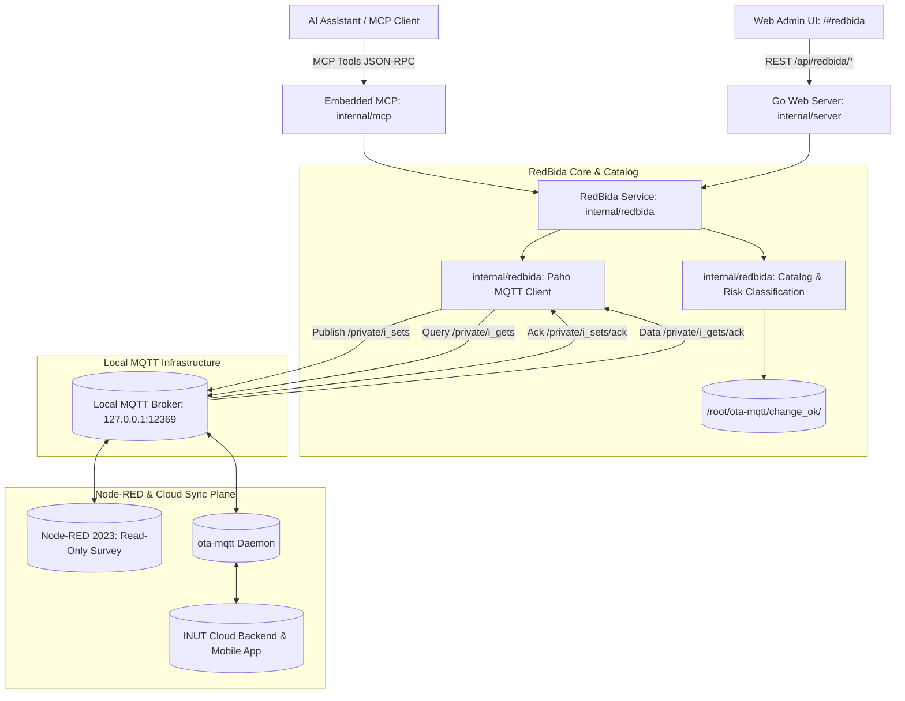

# Khảo Sát & Thiết Kế Kiến Trúc: R2 — Nâng Cấp Toàn Diện Giao Diện `/#redbida`

> **Tài liệu Khảo sát Toàn diện & Bản thiết kế Kỹ thuật (Comprehensive Survey & Architectural Blueprint)**  
> **Dự án:** `ksp-camera-auto` (`kspcam`)  
> **Mục tiêu:** R2 — Nâng cấp toàn diện giao diện `/#redbida` đạt đỉnh cao thẩm mỹ Modern Glassmorphism, Micro-interactions, Golden Standard Inspector & 1-Click Auto-Fix, Bộ sưu tập 8 CSS Gradient Palette, Visual 20-Tab INI Editor `[C01]`..`[C20]`, Smart Hashtag Generator, và Bảng Quản trị Key Cao Cấp.

---

## 1. Tổng Quan Kiến Trúc Hiện Tại Của Phân Hệ RedBida

### 1.1 Sơ Đồ Khối Tích Hợp (End-to-End System Block Diagram)



### 1.2 Đánh Giá Hiện Trạng Các Thành Phần Codebase

| Thành phần | Đường dẫn file | Hiện trạng & Chức năng hiện hữu | Khoảng cách cần nâng cấp (Gap Analysis) |
|---|---|---|---|
| **Frontend UI / DOM** | `web/static/index.html` (dòng 544–767) | Đã có Glass Metric Cards, Panel Preset 1-click cơ bản, Knowledge Hub 4 trụ cột, Toolbar tìm kiếm và bảng Key/Value thô. | - Mới có 6 swatch màu đơn giản, chưa đủ 8 bảng màu chuẩn theo spec.<br>- Chưa có widget Golden Standard Inspector & thanh tiến độ % Chuẩn Bida.<br>- Chưa có Visual 20-Tab INI Editor cho `ui_tabs_links`.<br>- Preset form chưa có live dynamic hashtag generator khi gõ tên quán. |
| **Frontend Logic** | `web/static/redbida.js` (598 dòng) | Quản lý `redbidaState`, hàm `removeVietnameseTones`, gọi API catalog/refresh/apply/time-status, sinh preset 15 key, swatch switcher, diff card. | - Cần bổ sung Engine Kiểm tra Chuẩn (Golden Standard Inspector) tính % Chuẩn Bida & Auto-Fix 1-Click.<br>- Cần xây dựng Visual Matrix 20-Tab `[C01]`..`[C20]` thay thế ô textarea raw.<br>- Cần gắn Live Unicode Normalizer vào input `ui_title` để sinh hashtag realtime.<br>- Cần 8 Gradient presets + Live Canvas Preview phong cách Bida. |
| **Giao diện CSS** | `web/static/style.css` (dòng 240–700) | Glassmorphism cơ bản (`var(--glass-bg-card)`, `var(--glass-blur)`), metric cards, swatch buttons, gradient preview box, diff card, 4-pillar cards. | - Bổ sung styling cho Inspector Widget, Progress Bar đa tầng (Green/Amber/Red), Matrix Grid 20 Tabs, Live Simulation Canvas, Checkerboard cho logo alpha. |
| **Backend Service** | `internal/redbida/catalog.go`, `service.go`, `mqtt.go` | Dò tìm key, phân loại 6 nhóm, phân loại 4 mức Risk (`editable`, `confirm-required`, `read-only-protected`, `unknown`), xác minh đọc lại 3 lần qua MQTT. | - Đã hoàn thiện 100%, bảo toàn tính tương thích tuyệt đối, không cần can thiệp logic nhị phân. |
| **Backend REST API** | `internal/server/api_redbida.go` | Tuyến `/api/redbida/catalog`, `/api/redbida/refresh`, `/api/redbida/apply`, `/api/redbida/time-status`. | - Hoạt động hoàn hảo, hỗ trợ batch apply và xác minh đọc lại. |
| **MCP Tools** | `internal/mcp/tools_redbida.go` | 6 công cụ MCP: `redbida_list_catalog`, `redbida_get_keys`, `redbida_set_keys`, `redbida_apply_onboarding_preset`, `redbida_trigger_go2rtc`, `redbida_get_time_status`. | - Đã chuẩn hóa 15 tham số Golden Template, pass 100% tests. |

---

## 2. Chi Tiết 5 Trụ Cột Nâng Cấp Toàn Diện R2

---

### 2.1 Trụ Cột 1: Trợ Lý Kiểm Tra Chuẩn Tự Động (Golden Standard Inspector & 1-Click Auto-Fix)

#### A. Bộ 15 Tham Số Quy Chuẩn Bida (15 Golden Standard Parameters)

| STT | Key Name | Nhóm | Kiểu dữ liệu | Giá trị chuẩn mẫu (Golden Standard Rule) | Logic phát hiện lệch chuẩn (Discrepancy Trigger) | Giải pháp Sửa nhanh 1-Click (Auto-Fix Transformation) |
|---|---|---|---|---|---|---|
| 1 | `ui_title` | `UI / Display` | `string` | Tên quán bida không rỗng (VD: `CX King Luxury`) | Giá trị rỗng, `undefined` hoặc chỉ chứa khoảng trắng | Nhập tên quán hoặc dùng tên mặc định `CX King Luxury` |
| 2 | `company_name` | `Branding / Logo` | `string` | Phải trùng khớp tuyệt đối với `ui_title` | `company_name !== ui_title` | Gán `company_name = ui_title` |
| 3 | `ui_bg` | `UI / Display` | `string` | CSS Gradient chuẩn, **KHÔNG có dấu `;` ở cuối** | Có dấu chấm phẩy `;` ở cuối, hoặc rỗng | `ui_bg.replace(/;\s*$/, '').trim()`, nếu rỗng gán mẫu `Royal Deep Blue Glow` |
| 4 | `custom_hashtags` | `Branding / Logo` | `string` | `#<CleanTitle> #BILLIARDSlive #INUTlive #highlightsports` (**KHÔNG có dấu tiếng Việt, không khoảng trắng trong tag**) | Chứa ký tự tiếng Việt có dấu (`à, á, ả, đ...`), thiếu 3 tag chuẩn | Loại bỏ dấu tiếng Việt qua Unicode NFD, sinh lại đúng định dạng chuẩn |
| 5 | `ui_tabs_links` | `UI / Display` | `string` (INI) | Đúng 20 section `[C01]` .. `[C20]`, dòng 3 `vid_play_label = <ui_title>` | Thiếu section, sai format INI, hoặc `vid_play_label` khác `ui_title` | Tự động sinh lại toàn bộ 20 section `[C01]`..`[C20]` với `vid_play_label = ui_title` |
| 6 | `camera_count` | `Livestream` | `number` | Số nguyên dương (1..20), khớp với số monitor Shinobi hoạt động | Mismatch với số monitor Shinobi (nếu có) hoặc không phải số 1..20 | Gán bằng số monitor Shinobi (hoặc `toolbar_show_count` / default 8) |
| 7 | `toolbar_show_count` | `Livestream` | `number` | Số nguyên dương bằng chính xác `camera_count` | `toolbar_show_count !== camera_count` | Gán `toolbar_show_count = camera_count` |
| 8 | `video_config` | `Livestream` | `string` | `range=72` (giới hạn tra cứu highlight 72h) | Khác chuỗi `range=72` | Gán `video_config = "range=72"` |
| 9 | `hls_using_go2rtc` | `Livestream` | `boolean` | `true` | Khác `true` | Gán `hls_using_go2rtc = true` |
| 10 | `hls_using_go2rtc_livestream` | `Livestream` | `boolean` | `true` | Khác `true` | Gán `hls_using_go2rtc_livestream = true` |
| 11 | `hls_using_go2rtc_tiktok` | `Livestream` | `boolean` | `true` | Khác `true` | Gán `hls_using_go2rtc_tiktok = true` |
| 12 | `ui_scoreboard` | `UI / Display` | `boolean` | `true` | Khác `true` | Gán `ui_scoreboard = true` |
| 13 | `logo_header` | `Branding / Logo` | `image` | `https://vnmap-backend.inut.vn/uploads/bidalive_efd101c4e6.png` hoặc logo URL hợp lệ | Rỗng hoặc không phải URL/data URL ảnh | Gán URL logo chuẩn `bidalive_efd101c4e6.png` |
| 14 | `logo_header_text` | `Branding / Logo` | `string` | `Billiard Live - Tải clip bàn bida và livestream` | Khác slogan chuẩn | Gán đúng slogan chuẩn |
| 15 | `button_generate_go2rtc_stream` | `Livestream` | `boolean` | Cờ kích hoạt sinh luồng Go2RTC | Chưa được kích hoạt khi cấu hình có thay đổi | Gán `button_generate_go2rtc_stream = true` |

#### B. Thuật Toán Tính % Chuẩn Hóa (% Chuẩn Bida)
$$\text{Score} = \left(\frac{\text{Số key thỏa mãn quy chuẩn}}{\text{Tổng 15 key quy chuẩn}}\right) \times 100\%$$

- **Phân cấp màu sắc thanh tiến độ (Dynamic Visual Progress Bar)**:
  - **100%**: Xanh lục Gradient (`linear-gradient(90deg, #10b981, #059669)`), Badge **"100% Chuẩn Bida (Hoàn Hảo)"**.
  - **70% - 99%**: Vàng cam Amber (`linear-gradient(90deg, #f59e0b, #d97706)`), Badge **"Cần Hoàn Thiện Nhẹ"**.
  - **< 70%**: Đỏ Coral (`linear-gradient(90deg, #ef4444, #dc2626)`), Badge **"Chưa Đạt Chuẩn Onboarding"**.

#### C. Thao Tác 1-Click Auto-Fix
- **Nút sửa từng tham số (Per-key Quick Fix)**: Nằm ngay cạnh từng dòng tiêu chí trong danh sách audit, bấm vào lập tức nạp giá trị chuẩn vào `redbidaState.drafts`, đánh dấu hàng dirty và cập nhật preview.
- **Nút sửa toàn diện (Global 1-Click Auto-Fix All)**: Quét toàn bộ các key bị lệch, nạp đồng loạt 15 tham số chuẩn vào drafts, hiển thị Diff Card sẵn sàng Submit lên MQTT.

---

### 2.2 Trụ Cột 2: Bộ Sưu Tập 8 Bảng Màu Gradient Bida Đẳng Cấp & Live Canvas Preview

#### A. Chi Tiết 8 Gradient Presets Chuẩn Phong Cách Bida Cao Cấp

```javascript
const REDBIDA_GRADIENT_PALETTE = [
  {
    id: 'royal-deep-blue',
    name: 'Royal Deep Blue Glow',
    desc: 'Xanh Hoàng Gia Sâu Thẳm',
    css: 'radial-gradient( circle farthest-corner at 10% 20%, rgba(2,37,78,1) 0%, rgba(4,4,16,1) 90.1% )',
    swatch: 'radial-gradient(circle, #02254e 0%, #040410 90%)',
  },
  {
    id: 'midnight-emerald',
    name: 'Midnight Emerald Cyber',
    desc: 'Ngọc Lục Bảo Cyber Huyền Bí',
    css: 'linear-gradient(135deg, #093028 0%, #17583e 50%, #237a57 100%)',
    swatch: 'linear-gradient(135deg, #093028, #237a57)',
  },
  {
    id: 'cyberpunk-neon',
    name: 'Cyberpunk Neon',
    desc: 'Tím Dạ Quang Cyberpunk',
    css: 'linear-gradient(135deg, #0f0c29 0%, #302b63 50%, #24243e 100%)',
    swatch: 'linear-gradient(135deg, #0f0c29, #302b63, #24243e)',
  },
  {
    id: 'golden-velvet',
    name: 'Golden Velvet',
    desc: 'Nhung Vàng Sang Trọng',
    css: 'linear-gradient(135deg, #2c1a04 0%, #59390a 50%, #1f1202 100%)',
    swatch: 'linear-gradient(135deg, #2c1a04, #59390a, #1f1202)',
  },
  {
    id: 'obsidian-carbon',
    name: 'Obsidian Carbon',
    desc: 'Than Chì Carbon Lịch Lãm',
    css: 'linear-gradient(135deg, #0f2027 0%, #203a43 50%, #2c5364 100%)',
    swatch: 'linear-gradient(135deg, #0f2027, #203a43, #2c5364)',
  },
  {
    id: 'crimson-elegance',
    name: 'Crimson Elegance',
    desc: 'Đỏ Rượu Vang Quý Phái',
    css: 'linear-gradient(135deg, #3a0007 0%, #6b0f1a 50%, #1a0003 100%)',
    swatch: 'linear-gradient(135deg, #3a0007, #6b0f1a, #1a0003)',
  },
  {
    id: 'sapphire-blue',
    name: 'Sapphire Blue',
    desc: 'Lam Ngọc Tinh Tế',
    css: 'linear-gradient(135deg, #001529 0%, #003a8c 50%, #001020 100%)',
    swatch: 'linear-gradient(135deg, #001529, #003a8c, #001020)',
  },
  {
    id: 'ruby-luxury',
    name: 'Ruby Luxury',
    desc: 'Hồng Ngọc Ruby Đẳng Cấp',
    css: 'linear-gradient(135deg, #4a0011 0%, #7d0a26 50%, #2b000a 100%)',
    swatch: 'linear-gradient(135deg, #4a0011, #7d0a26, #2b000a)',
  },
];
```

#### B. Khung Trình Diễn Mô Phỏng Trực Quan (Live Canvas Simulation)
Khung Canvas Live Preview mô phỏng trực tiếp toàn bộ giao diện khách hàng cuối nhìn thấy:
- **Logo Watermark**: Hiển thị ảnh logo góc trên bên trái.
- **Tiêu đề & Tên Quán**: Hiển thị `ui_title` cỡ chữ lớn kèm đổ bóng Text Shadow chuẩn cinema.
- **Slogan phụ**: Hiển thị `logo_header_text`.
- **Hashtags Bar**: Hiển thị các viên badge hashtag realtime.
- **Mô phỏng Thanh Bàn Bida (Tab Simulator)**: Hàng nút chọn bàn bida `Bàn 01`, `Bàn 02`... trên nền gradient đang chọn.

---

### 2.3 Trụ Cột 3: Trình Soạn Thảo Tab INI Trực Quan (Visual 20-Tab INI Matrix Editor `[C01]`..`[C20]`)

#### A. Cấu Trúc Khung Nhập Liệu
Thay vì để người dùng thao tác trong ô `<textarea>` thô sơ dễ sai cú pháp, hệ thống cung cấp giao diện tương tác 2 tầng:

1. **Ma Trận Chọn 20 Bàn (20-Table Matrix Grid Bar)**:
   - 20 nút dạng thẻ/pill được đánh số từ `Bàn 01` (`C01`) đến `Bàn 20` (`C20`).
   - Trạng thái trực quan: Nút đang chọn (Active glow), nút có dữ liệu hợp lệ (Badge xanh), nút chưa đồng bộ tên quán (Cảnh báo vàng).
2. **Bảng Điều Khiển Chi Tiết Từng Bàn (Per-Table Form Inspector)**:
   - Ô nhập **Tên Bàn / Tiêu Đề Phát (`vid_play_label`)**: Mặc định kế thừa tên quán `ui_title`.
   - Ô nhập **Nhãn Luồng Trực Tiếp (`stream_label`)**: Mặc định `Video Trực tiếp`.
   - Ô nhập **Nhãn Danh Sách Highlight (`vid_list_label`)**: Mặc định `Danh sách highlight`.
   - Ô nhập **Nhãn Nút Cập Nhật (`list_refresh_label`)**: Mặc định `Cập nhật highlight`.
3. **Thao Tác Nhanh Tiện Ích (Quick Action Toolbar)**:
   - 📋 **Sao chép URL Luồng RTSP/HLS**: Tự động sinh URL phát trực tiếp tương ứng với số bàn (Channel ID / RTSP subtype 0) để dán vào phần mềm OBS hoặc ứng dụng khác.
   - ⚡ **Đồng bộ tên quán cho toàn bộ 20 bàn**: 1-click cập nhật `vid_play_label = ui_title` cho toàn bộ 20 section mà không làm mất các nhãn tùy biến khác.
   - 🔄 **Chuyển đổi Chế độ Xem (Toggle Visual Form / Raw INI Code)**: Cho phép chuyển qua lại giữa giao diện lưới trực quan và ô Textarea INI Monospace cho lập trình viên muốn copy/paste hàng loạt.

---

### 2.4 Trụ Cột 4: Trình Sinh Hashtag Thông Minh & Khử Dấu Tiếng Việt Chuẩn Hóa Unicode

#### A. Cơ Chế Khử Dấu Chuẩn Hóa Unicode (NFC / NFD Normalization)
Xử lý triệt để tất cả các biến thể dấu tiếng Việt bao gồm cả tổ hợp ký tự rời (Combining Diacritical Marks `\u0300-\u036F`) và chữ đ/Đ:

```javascript
function removeVietnameseTones(str) {
  if (!str || typeof str !== 'string') return '';
  return str
    .normalize('NFD')
    .replace(/[\u0300-\u036f]/g, '')
    .replace(/[đĐ]/g, m => (m === 'đ' ? 'd' : 'D'));
}

function sanitizeCleanTitle(title) {
  return removeVietnameseTones(title).replace(/[^a-zA-Z0-9]/g, '');
}

function generateSmartHashtags(title) {
  const clean = sanitizeCleanTitle(title);
  if (!clean) return '#BILLIARDSlive #INUTlive #highlightsports';
  return `#${clean} #BILLIARDSlive #INUTlive #highlightsports`;
}
```

#### B. Phản Hồi Tức Thì Khi Gõ (Real-time Dynamic Typing Event)
- Ngay khi người dùng gõ vào ô `Tên Quán Bida (ui_title)`, trường Hashtag preview và giá trị draft `custom_hashtags` sẽ tự động cập nhật ngay lập tức mà không cần bấm thêm nút nào.

---

### 2.5 Trụ Cột 5: Bảng Quản Trị Key Cao Cấp (Enhanced Key Management & Visual Glassmorphism)

1. **Bộ Lọc Đa Tầng (Multi-dimensional Filtering)**:
   - Lọc tìm kiếm tức thời theo Key, Label, Description, Group.
   - Dropdown lọc theo 6 nhóm chức năng.
   - Checkbox "Chỉ hiển thị thay đổi" (Dirty only).
2. **Hệ Thống Phân Loại Risk Badge Sang Trọng**:
   - `editable` (Xanh lá ngọc lục bảo / Accent Glass): Có thể sửa trực tiếp.
   - `confirm-required` (Vàng hổ phách / Amber Warning): Thao tác nhạy cảm (reboot/restart/schedule).
   - `read-only-protected` (Đỏ / Slate Shield): Khóa chỉ đọc, bảo vệ thông tin mật và mạng.
3. **Xem Trước Trực Tiếp Tại Từng Hàng (Inline Row Previews)**:
   - **Ảnh / Logo Watermark**: Nền bàn cờ caro checkerboard chống lóa nền alpha trong suốt.
   - **Màu Nền CSS `ui_bg`**: Mini bar preview hiển thị gradient thực tế ngay trong ô nhập.
   - **JSON / INI**: Định dạng monospace thụt dòng chuẩn.

---

## 3. Bản Kế Hoạch Triển Khai Chi Tiết (Implementation Roadmap)

### 3.1 Danh Sách Tác Vụ Cần Thực Hiện

1. **`web/static/index.html`**:
   - Bổ sung cấu trúc DOM cho **Golden Standard Inspector** (Thanh tiến độ % Chuẩn Bida, Thẻ tóm tắt, Danh sách kiểm tra 15 tiêu chí, Nút Auto-Fix All).
   - Bổ sung cấu trúc **Visual 20-Tab INI Matrix Editor** (Thanh chọn 20 bàn `C01`..`C20`, form chi tiết 4 trường nhãn, nút sao chép URL luồng, nút đồng bộ tên quán, nút chuyển đổi Raw INI).
   - Cập nhật 8 swatch buttons cho **8 Gradient Presets** (Royal Deep Blue Glow, Midnight Emerald Cyber, Cyberpunk Neon, Golden Velvet, Obsidian Carbon, Crimson Elegance, Sapphire Blue, Ruby Luxury).
   - Nâng cấp **Live Canvas Preview** hiển thị đầy đủ logo, tiêu đề, slogan, hashtags và simulator bàn bida.
2. **`web/static/redbida.js`**:
   - Thêm mảng định nghĩa `REDBIDA_GRADIENT_PALETTE` (8 mẫu).
   - Thêm Engine `redbidaAuditGoldenStandard()`: duyệt 15 tham số, tính điểm %, render checklist và xử lý auto-fix.
   - Thêm Engine `redbidaAutoFixKey(key)` và `redbidaAutoFixAll()`.
   - Thêm Engine `redbidaInit20TabEditor()`: quản lý trạng thái 20 bàn INI, phân tích cú pháp INI 2 chiều (Parse INI string <-> Form Object), sinh URL luồng RTSP/HLS nhanh.
   - Thêm Event Listener gõ tên quán sinh hashtag realtime.
3. **`web/static/style.css`**:
   - Thêm các lớp CSS cho Inspector Progress Bar, Status Badges, Matrix Grid Buttons, Visual INI Form, Swatches Glow, Live Canvas Simulation.
4. **Kiểm Thử (Verification & E2E)**:
   - Chạy toàn bộ unit tests Go `PATH=/home/ksp/.goroot/bin:$PATH go test ./...`.
   - Chạy toàn bộ Playwright UI tests `npx playwright test tests/ui/redbida.spec.js tests/ui/redbida_m3_challenger.spec.js`.
   - Viết thêm các test assertions kiểm tra 8 bảng màu gradient, 20-tab INI matrix, tính năng auto-fix và audit 15 keys.

---

## 4. Kết Luận Khảo Sát

Toàn bộ nền tảng backend Go (`internal/redbida`, `internal/server/api_redbida.go`, `internal/mcp/tools_redbida.go`) và giao thức MQTT nội bộ `127.0.0.1:12369` đã vận hành cực kỳ ổn định, bảo mật và tương thích hoàn toàn.

Công việc nâng cấp R2 cho `/#redbida` tập trung 100% vào lớp hiển thị và tương tác người dùng (Frontend SPA: `index.html`, `redbida.js`, `style.css`), mang lại một bước nhảy vọt về đẳng cấp thẩm mỹ (Glassmorphism), tốc độ thao tác (1-Click Presets & Auto-Fix) và độ an toàn kỹ thuật (Visual Matrix & Audit Engine).
