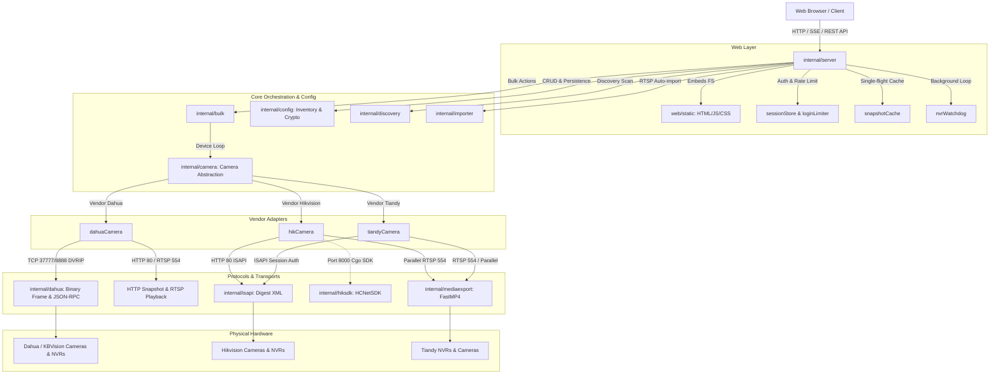
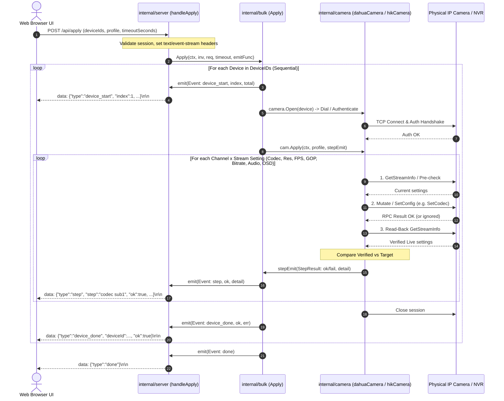
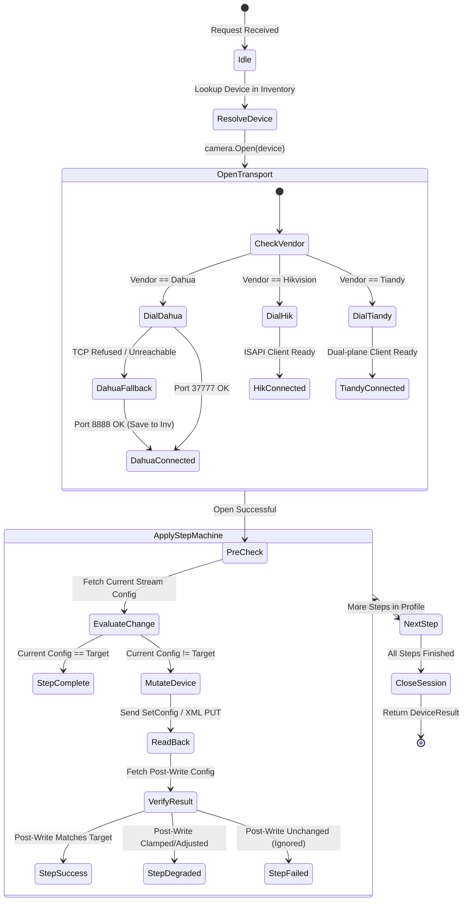
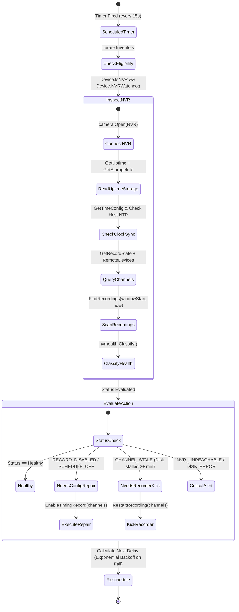

# Comprehensive Architecture & System Survey: `ksp-camera-auto`

## 1. Observation

Direct inspection of the repository (`/home/ksp/ksp-camera-auto`) reveals the following components, concrete implementations, and code artifacts.

### 1.1 Package Topology & Module Layout
The project is a single-module Go 1.25 codebase (`go.mod`) with zero external C dependencies in default builds (`CGO_ENABLED=0`):
- `cmd/kspcam/main.go` (129 lines): Command line flags (`--config`, `--addr`, `--version`, `--hash-password`, `--import-shinobi`, `--import-hik-port`, `--import-dahua-port`), configuration and inventory loading, HTTP server startup, graceful signal handling (`SIGINT`, `SIGTERM`).
- `internal/config/` (`config.go`, `inventory.go`, `crypto.go`): Configuration definitions, zero-value default backfilling (`applyDefaults`), thread-safe `Inventory` (`sync.RWMutex`), atomic file persistence (`.tmp` + `os.Rename`), AES-256-GCM encryption with `enc:` prefix.
- `internal/camera/` (`camera.go`, `hik_http.go`, `hik_sdk.go`, `fps_test.go`, `port_fallback_test.go`): Vendor-agnostic `Camera` interface, specialized capability interfaces (`FPSSettings`, `DeviceIdentity`, `PictureSettings`, `NetworkSettings`, `Rebooter`, `StorageManager`, `RemoteDeviceLister`, `AutoRebootConfig`, `DeviceTimeConfig`, `NVRHealthConfig`, `Recorder`, `PTZControl`), factory `camera.Open()`, and per-vendor adapters (`dahuaCamera`, `hikCamera`, `tiandyCamera`).
- `internal/bulk/` (`bulk.go`, `credtest.go`): Sequential orchestrator for batch configuration (`bulk.Apply`) and credential probing (`bulk.TryPasswords`), streaming `bulk.Event` / `bulk.CredTestEvent`.
- `internal/server/` (`server.go`, `api.go`, `api_scan.go`, `snapshot_cache.go`, `nvr_health.go`): Web server, HTTP routing, session authentication with constant-time check and bcrypt hash support, role authorization (`admin` vs `viewer`), brute-force login limiter with sliding lockout window, single-flight TTL snapshot cache (`snapCache`), HMAC-SHA256 signed playback download links (`/api/playback-token`), NVR watchdog background engine.
- `web/` (`embed.go`, `static/index.html`, `static/login.html`, `static/style.css`, `static/app.js`, `static/ui-core.js`, `static/help.js`, `static/review.js`, `static/qrcode.min.js`, `static/vis-timeline-graph2d.min.js`): Embedded UI assets via `go:embed static`.
- `internal/dahua/`: Pure-Go implementation of Dahua/KBVision DVRIP protocol on TCP (ports 37777 / 8888), binary framing, 2-step MD5 login, JSON-RPC `configManager` get/set, live multipart MJPEG streaming, RTSP playback remuxing, `.dav` (DHAV) binary downloading.
- `internal/isapi/`: Pure-Go Hikvision ISAPI client over HTTP/Digest (port 80) with XML serialization (`StreamingChannel`, `SmartCodec`, `AudioChannel`, `InputProxy`, `Storage`, `NetworkInterface`, `TextOverlayList`), pluggable `Transport` interface.
- `internal/hik/`: Thin adapter over `isapi.Client` mapping 0-based neutral channels to 1-based ISAPI channels, native `IMKH` download, parallel RTSP export integration.
- `internal/hiksdk/`: Cgo backend for Hikvision port 8000 HCNetSDK (`NET_DVR_STDXMLConfig`) under build tag `hiksdk`.
- `internal/tiandy/`: Dual-plane Tiandy client: RTSP media plane (playback, live MJPEG, snapshot) + ISAPI session config plane.
- `internal/discovery/`: Network discovery via ONVIF (UDP 3702), Dahua DHDiscover (UDP 37810), Hikvision SADP (UDP 37020), and `nmap` subnet scanning.
- `internal/importer/`: Parser for Shinobi monitor JSON with automatic vendor detection from RTSP URL patterns.
- `internal/nvrhealth/`: Classification of NVR recording health, timeline interval coverage calculations, and automatic repair scheduling.
- `internal/mediaexport/`: Parallel chunked RTSP extraction engine for fast MP4/MKV generation.

---

### 1.2 Web UI & REST API Endpoints

#### Authentication & Authorization Architecture
- **Cookie Session**: `kspcam_session` (Hex-encoded 32-byte cryptographically random token, 12h TTL in `sessionStore`).
- **Roles**:
  - `admin`: Full access to all endpoints, configuration, passwords, hardware reboots, storage formatting, OSD, and picture tuning.
  - `viewer`: Read-only access restricted strictly to `/api/config`, `/api/cameras` (GET), `/api/recordings` (GET), `/api/live` (GET), `/api/snapshot` (GET), and `/api/playback-token`.
- **HMAC Playback Token**:
  - `HMAC-SHA256(dlKey, id|channel|start|end|fast|download|exp)` generated via `GET /api/playback-token`. Allows unauthenticated mobile phones to stream or download recordings via QR code.

#### REST API Endpoint Matrix
| Route | Method | Role | Payload (Req / Res) | Description |
|---|---|---|---|---|
| `/login` | `GET`, `POST` | Public | Form: `username`, `password` | Authenticate session; throttled by `loginLimiter` |
| `/logout` | `GET`, `POST` | Public | None | Destroy session and clear cookie |
| `/healthz` | `GET` | Public | None / `200 ok` | Liveness health check |
| `/api/config` | `GET` | Viewer/Admin | None / `{maxReviewHours, role}` | Client configuration bootstrap |
| `/api/cameras` | `GET` | Viewer/Admin | None / `[]deviceView` | List inventory devices |
| `/api/cameras` | `POST` | Admin | `cameraUpsertReq` / `deviceView` | Add or update camera in inventory |
| `/api/cameras/delete` | `POST` | Admin | `{id}` / `{ok: true}` | Delete single camera from inventory |
| `/api/cameras/delete-bulk` | `POST` | Admin | `{ids: []string}` / `{ok, deleted, skipped}` | Delete multiple cameras in one transaction |
| `/api/probe` | `POST` | Admin | `{id, timeoutSeconds}` / `probeView` | Probe live stream encode params & serial number |
| `/api/fps-capability` | `POST` | Admin | `{id, channel, stream, width, height, codec}` | Query safe FPS ceiling for given resolution |
| `/api/apply` | `POST` | Admin | `bulk.Request` / SSE stream (`bulk.Event`) | Bulk apply profile settings sequentially |
| `/api/password` | `POST` | Admin | `passwordReq` / SSE stream (`bulk.Event`) | Bulk change passwords & update inventory |
| `/api/scan` | `POST` | Admin | `{method, subnet}` / `[]discovery.Result` | LAN Discovery (ONVIF, Dahua, Hik SADP, nmap) |
| `/api/scan/try-password` | `POST` | Admin | `tryPasswordReq` / SSE stream (`CredTestEvent`) | Test candidate credentials on scan results |
| `/api/import` | `POST` | Admin | `importReq` / `{added, skipped}` | Import Shinobi monitor export JSON |
| `/api/snapshot` | `GET` | Viewer/Admin | Query: `id, channel, stream` / `image/jpeg` | Fetch single JPEG frame (via `snapCache`) |
| `/api/live` | `GET` | Viewer/Admin | Query: `id, channel, fps` / MJPEG stream | Live low-latency video (`multipart/x-mixed-replace`) |
| `/api/ptz` | `POST` | Admin | `{id, channel, code, speed, start}` | Live Pan/Tilt/Zoom control command |
| `/api/reboot` | `POST` | Admin | `{id, timeoutSeconds}` / `{ok, note}` | Trigger remote hardware reboot |
| `/api/storage` | `GET`, `POST` | Admin | GET: `id` / POST: `{id, name}` | Get disk info / Format storage drive |
| `/api/recordings` | `GET` | Viewer/Admin | Query: `id, channel, start, end` | Find recorded segments in timeframe |
| `/api/playback` | `GET` | Auth/Token | Query: `id, channel, start, end, format, download` | Stream/download video (MP4 / native DAV / MKV) |
| `/api/playback-token` | `GET` | Viewer/Admin | Query: `id, channel, start, end` / `{token, exp}` | Mint short-lived HMAC token for QR download |
| `/api/export-progress` | `GET` | Viewer/Admin | Query: `job` / `{done, total, phase, error}` | Poll chunked download progress |
| `/api/channel-info` | `GET` | Admin | Query: `id, channel` | Query camera title & OSD lines |
| `/api/channel-name` | `POST` | Admin | `{id, channel, name}` | Set on-camera channel name |
| `/api/osd` | `POST` | Admin | `{id, channel, lines, enabled}` | Set on-screen text overlay |
| `/api/picture` | `GET`, `POST` | Admin | GET: `id, channel` / POST: color + options | Read / mutate video color & image tuning |
| `/api/network` | `GET`, `POST` | Admin | GET: `id` / POST: `{id, iface, dhcp, ip, ...}` | Read / mutate static IP and network interface |
| `/api/wifi` | `GET`, `POST` | Admin | GET: `id` / POST: `{id, iface, ssid, pass}` | Read / configure Wi-Fi credentials |
| `/api/wifi-scan` | `POST` | Admin | `{id}` / `[]dahua.WiFiAP` | Trigger live Wi-Fi access-point scan |
| `/api/device-time` | `GET`, `POST` | Admin | GET: `id` / POST: `{id, time, ntpEnable, ...}` | Read / set device clock & NTP |
| `/api/autoreboot` | `GET`, `POST` | Admin | GET: `id` / POST: `AutoReboot` schedule | Read / configure scheduled maintenance reboot |
| `/api/nvr/scan` | `POST` | Admin | `nvrScanReq` / `[]nvrScanRow` | Scan NVR channel-to-IP mappings |
| `/api/nvr/link` | `POST` | Admin | `nvrLinkReq` / `{ok: true}` | Save NVR-to-camera fallback links |
| `/api/nvr/health` | `GET` | Admin | Query: `id` / `nvrHealthReport` | Read NVR recording health state |
| `/api/nvr/health/check` | `POST` | Admin | `{id}` / `nvrHealthReport` | Force immediate NVR health inspection |
| `/api/nvr/watchdog` | `POST` | Admin | `{id, enabled, syncTimeFromHost}` | Toggle background auto-healing watchdog |

---

### 1.3 Sequential Execution Engine (`internal/bulk`)
- **Sequential Guarantee**: `bulk.Apply` and `bulk.TryPasswords` use linear loops (`for i, id := range req.DeviceIDs`), processing exactly one camera at a time.
  - *Rationale*: Re-encoding operations (resolution, codec, GOP changes) cause transient RTSP/video stream drops and spikes in device CPU/bus usage. Running concurrently on an NVR or local switch can crash camera network stacks or drop live recording streams.
- **Error Isolation**:
  - Device-level errors (offline host, wrong password, bad socket) do not abort the loop. The error is recorded into `DeviceResult` / `CredTestEvent`, emitted via SSE, and the loop proceeds to the next device.
  - Step-level errors (`applyOne` calling `cam.Apply`) attempt all requested steps (Codec -> Resolution -> FPS -> GOP -> Bitrate -> Audio -> Smart Codec -> OSD) even if an earlier step failed, recording a detailed `StepResult` per action.
- **Progress Tracking & Streaming**:
  - `Event` types: `device_start`, `step`, `device_done`, `done`.
  - The HTTP handler writes `data: {"type":"step",...}\n\n` directly to the `http.ResponseWriter` and immediately flushes via `http.Flusher`.
- **Dynamic Timeout Scaling**:
  - Timeout is clamped between 5s and 600s (`reqTimeout`).
  - Total context deadline scales linearly with batch size: `timeout * (len(devices) + 1)`.

---

### 1.4 Camera Abstraction Layer (`internal/camera`)
- **Core Interface**:
```go
type Camera interface {
    Probe(ctx context.Context) ([]StreamInfo, error)
    Apply(ctx context.Context, profile Profile, emit func(StepResult)) []StepResult
    ChangePassword(ctx context.Context, newUser, newPass string) error
    Snapshot(ctx context.Context, channel, stream int) ([]byte, error)
    ChannelInfo(ctx context.Context, channel int) (name string, osdLines []string, osdEnabled []bool, osdSupported bool, err error)
    SetChannelName(ctx context.Context, channel int, name string) error
    SetOSDLines(ctx context.Context, channel int, lines []string, enabled []bool) (applied int, err error)
    Close() error
}
```
- **Capability Extensions (Type Assertions)**:
  - `FPSSettings`: `GetFPSCapability(ctx, channel, stream, w, h, codec)`
  - `DeviceIdentity`: `GetSerialNumber(ctx)`
  - `PictureSettings`: `GetPicture`, `SetPicture`, `GetPictureCaps`
  - `NetworkSettings`: `GetNetworkConfig`, `SetStaticIP`, `GetWiFiConfig`, `SetWiFiConfig`, `ScanWiFi`
  - `Rebooter`: `Reboot(ctx)`
  - `StorageManager`: `GetStorageInfo`, `FormatStorage`
  - `RemoteDeviceLister`: `GetRemoteDevices`
  - `AutoRebootConfig`: `GetAutoReboot`, `SetAutoReboot`
  - `DeviceTimeConfig`: `GetTimeConfig`, `SetTimeConfig`
  - `NVRHealthConfig`: `GetRecordState`, `EnableTimingRecord`, `RestartRecording`, `GetUptime`
  - `Recorder`: `FindRecordings`, `StreamPlayback`, `StreamPlaybackFast`, `StreamNative`
  - `PTZControl`: `PTZMove`

- **Probe -> Apply -> Read-back State Machine**:
  - Both Dahua and Hikvision firmwares frequently accept out-of-range or unsupported parameters (e.g. setting H.265 on an H.264-only camera) with an HTTP 200 / `result: true` response without applying the change.
  - Therefore, every step in `Apply` performs:
    1. **Pre-check / Read**: Fetch current state (`GetStreamInfo`). If already matching target, succeed immediately.
    2. **Write / Mutate**: Send vendor command (`SetCodec`, `SetResolution`, `SetFPS`, `SetGOP`, `SetBitrate`, `SetAudioAAC`, `SetSmartCodec`, `SetOSDLines`).
    3. **Read-back Verification**: Re-query `GetStreamInfo` / `GetOSDLines`. Compare actual post-write state with requested target.
    4. **Step Result Emission**: Flag as `OK: true` if matches, or `OK: false` with detailed discrepancy message (e.g., `"codec không đổi được (cam không hỗ trợ?) — hiện tại: H.264"`).

---

### 1.5 Configuration Management (`internal/config`)
- **Structure**:
  - `server`: `addr` (`:2028`), `username` (`admin`), `password` (`smarthome12345`), `password_hash`, `viewer_username` (`viewer`), `viewer_password` (`inut12345`), `login_max_attempts` (5), `login_lockout_minutes` (30).
  - `cameras_file`: Path to inventory (`cameras.yaml`).
  - `defaults`: Per-vendor ports (`hikvision_port: 8000`, `dahua_port: 37777`, `tiandy_port: 554`), `username`, `password`, `timeout_seconds` (30), `new_password`, `max_review_hours` (72).
- **Graceful Defaults**: `config.Load(path)` returns a working `Default()` config even if the file is absent or incomplete (`applyDefaults()`).
- **Inventory Storage**:
  - Concurrency safety: Protected by `sync.RWMutex`.
  - Atomic persistence: Writes to `<path>.tmp` (mode `0600`) and executes `os.Rename` to eliminate corrupt files during sudden power losses.
  - Password Encryption at Rest: Transparently converts plaintext passwords to AES-256-GCM ciphertext prefixed with `enc:<base64>`. Stored passwords in-memory are decrypted on load; encryption is applied on disk save.
  - Key Resolution: Reads from `KSPCAM_KEY` (env), `KSPCAM_KEY_FILE` (env), or generates `~/.kspcam.key` (mode `0600`).

---

## 2. Logic Chain

1. **System Modularity & Dependency Inversion**:
   - `main.go` wires together `config`, `importer`, `inventory`, and `server`.
   - `server` acts as the HTTP controller and delegates domain actions to `bulk`, `camera`, `discovery`, and `nvrhealth`.
   - `bulk` and `server` never touch `internal/dahua`, `internal/isapi`, `internal/hik`, or `internal/tiandy` directly; they interface solely through `internal/camera`.
   - `internal/camera` acts as the translation boundary, normalizing channel numbers (converting 0-based domain channels to 1-based ISAPI channels `101, 201`), standardizing codec strings, and adapting vendor-specific error behaviors.

2. **Sequential Concurrency vs Live Responsiveness**:
   - Camera management over field networks (WAN, cellular routers, NAT ports) is fragile. Concurrent connections cause firmware lockups.
   - Sequential execution in `bulk` guarantees stability, while HTTP Chunked / Server-Sent Events (SSE) streaming ensures instantaneous user feedback in the browser without polling overhead.

3. **Read-Back Verification Necessity**:
   - Surveillance camera firmwares prioritize uptime over strict RPC compliance. Unknown parameters are ignored silently.
   - The mandatory read-back step in `camera.Apply` is the only mechanism to guarantee that configurations actually took effect on hardware sensors.

4. **Multi-Plane Architecture for Non-Standard Vendors (Tiandy & KBVision)**:
   - KBVision (Dahua OEM) occasionally listens on port 8888 instead of 37777. `camera.Open()` handles automatic transparent fallback on `ErrDialUnreachable` and callbacks to `inventory` to persist the discovered working port.
   - Tiandy lacks native byte-download APIs and proprietary config interfaces in pure-Go. It is partitioned into an RTSP media plane (`tiandy.Client` for streaming/parallel chunk download) and an ISAPI session configuration plane (`hikCamera` wrapper).

---

## 3. Architecture & Data Flow Diagrams

### 3.1 Overall System Architecture



---

### 3.2 Bulk Apply Execution Sequence (SSE Streaming)



---

### 3.3 Camera Parameter Modification & Verification State Machine



---

### 3.4 NVR Watchdog & Self-Healing Lifecycle



---

## 4. Caveats & Edge Cases

1. **Hikvision HCNetSDK (Port 8000)**:
   - Port 8000 binary protocol uses proprietary cryptographic handshakes. The default build is pure Go (`CGO_ENABLED=0`) and operates over ISAPI (port 80). The port 8000 SDK transport requires compiling with `-tags hiksdk` and supplying dynamic C libraries (`libhcnetsdk.so`).
2. **Dahua Snapshot Network Reachability**:
   - Dahua snapshot (`/cgi-bin/snapshot.cgi`) operates strictly over HTTP (port 80). If a Dahua camera is behind a NAT firewall with only the DVRIP port (37777) forwarded, snapshots will fail (HTTP 502) while all configuration operations (DVRIP) continue to work normally.
3. **Hikvision OSD Overlay Text Limitations**:
   - `ChannelInfo` skips OSD text read during bulk `Probe` to minimize request latency on large multi-channel NVRs. OSD lines are fetched on-demand when opening the channel edit panel.
4. **Tiandy Export Constraints**:
   - Fast parallel MP4 and native MKV downloads for Tiandy/Hikvision buffer temporary segments in `/tmp`. Because `/tmp` is typically a RAM-backed tmpfs (~1GB), single export sessions are bounded to 20 minutes maximum to prevent memory exhaustion.

---

## 5. Conclusion

The `ksp-camera-auto` codebase exhibits a well-isolated, fault-tolerant, and performance-conscious architecture:
- **Clean Separation of Concerns**: Web routing (`server`), batch coordination (`bulk`), device abstraction (`camera`), and wire protocols (`dahua`, `isapi`, `tiandy`) have strict hierarchical boundaries with zero circular dependencies.
- **Robust Field Operations**: Sequential execution, atomic file writes, AES-encrypted credential storage, transparent port fallback (KBVision 8888), and mandatory read-back verification make the tool resilient against unpredictable camera firmwares and network environments.
- **Modern Streaming UX**: SSE live progress logging, single-flight cached snapshots, and low-latency multipart MJPEG streams deliver responsive monitoring and management capabilities without heavy frontend framework dependencies.

---

## 6. Verification Method

To independently verify all findings and test suites:

1. **Verify Go Unit Tests**:
   ```bash
   export PATH=/home/ksp/.goroot/bin:$PATH
   go test -v ./...
   ```
2. **Verify Static Builds**:
   ```bash
   export PATH=/home/ksp/.goroot/bin:$PATH
   make build
   make build-all
   ```
3. **Verify Documentation & Help Index Integrity**:
   ```bash
   export PATH=/home/ksp/.goroot/bin:$PATH
   make docs-check
   ```
4. **Inspect Critical Core Files**:
   - Interface definitions: `internal/camera/camera.go`
   - Sequential engine: `internal/bulk/bulk.go`
   - Server & API routing: `internal/server/server.go` and `internal/server/api.go`
   - Config & crypto: `internal/config/config.go` and `internal/config/crypto.go`
   - Embedded UI root: `web/embed.go` and `web/static/app.js`
