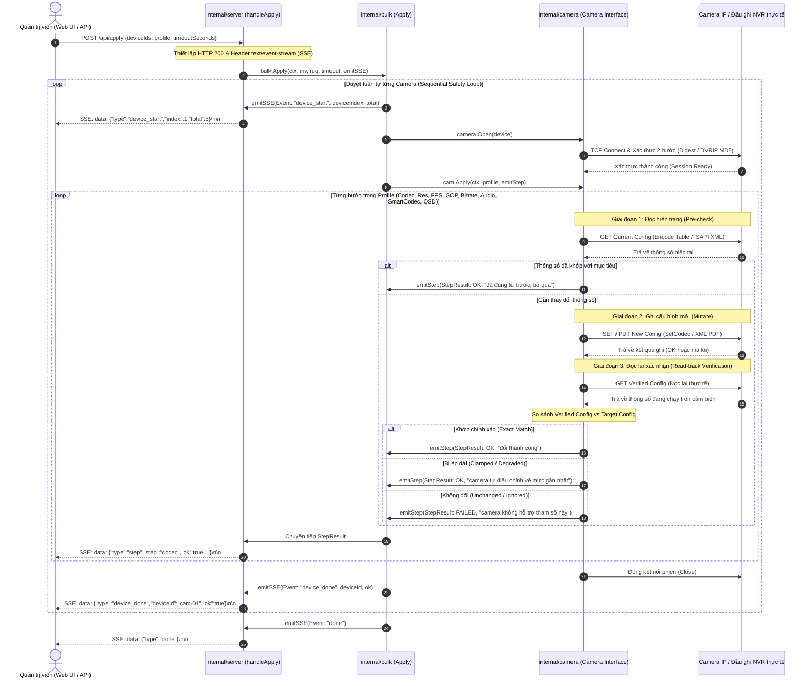
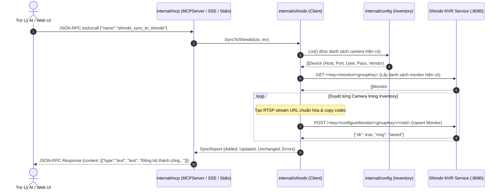

# GEMINI.md — Bộ Não Thứ Hai & Test Harness Context (ksp-camera-auto)

> **Mục đích tài liệu:** Đây là tài liệu tri thức trung tâm (Second Brain / Architecture & Harness Context) dành cho AI Agent (Gemini, Hermes, Claude...) và lập trình viên khi tham vấn, phát triển, gỡ lỗi, kiểm thử và mở rộng dự án `ksp-camera-auto`. Mọi quy ước, đặc tả giao thức gói tin, sơ đồ kiến trúc, gotchas thực địa và blueprint test harness đều được đối chiếu trực tiếp từ codebase thực tế.

> **Bản đồ codebase đã làm mới:** Xem [docs/CODEBASE-KNOWLEDGE.md](docs/CODEBASE-KNOWLEDGE.md) để có snapshot ngắn gọn, đối chiếu với source ngày 2026-08-24. Tài liệu này tiếp tục giữ các đặc tả protocol/gotcha chi tiết; khi có mâu thuẫn, ưu tiên code hiện tại và phần "Known Documentation Drift" trong bản đồ mới.

---

## 1. Tổng quan dự án & Triết lý thiết kế

`ksp-camera-auto` (`kspcam`) là hệ thống backend & giao diện quản trị nhúng chuyên dụng cho việc **dò tìm (discovery), cấu hình hàng loạt (bulk configuration), chẩn đoán sức khỏe và xuất trích xuất ghi hình** cho hệ thống Camera IP & Đầu ghi NVR đa hãng (**Dahua / KBVision**, **Hikvision**, **Tiandy**).

### 1.1 Triết lý cốt lõi (Core Philosophy)
1. **Thuần Go & Static Binary (`CGO_ENABLED=0`)**:
   - Bản build mặc định không sử dụng cgo, không phụ thuộc vào bất kỳ thư viện C động bên ngoài nào (như glibc hay vendor dynamic SDKs).
   - Cho phép cross-compile siêu nhẹ thành một file thực thi tĩnh duy nhất cho đa kiến trúc Linux (`linux/amd64`, `linux/armv7`, `linux/arm64`), sẵn sàng triển khai trên Raspberry Pi, Orange Pi, Edge Box, thiết bị Gateway x86/ARM hoặc Router công nghiệp.
2. **An toàn thiết bị là số 1 (Safety First - Sequential Execution)**:
   - Các thao tác điều chỉnh codec, độ phân giải, framerate, GOP và bitrate sẽ làm khởi động lại bộ mã hóa phần cứng (DSP/ISP encoder) của camera, gây ngắt luồng video và tăng vọt tải CPU/bus.
   - Ứng dụng áp dụng nguyên tắc **thực thi tuần tự (sequential execution)** tuyệt đối trên từng camera trong danh sách bulk để chống sập mạng LAN, chống tràn bảng socket switch/router và tránh làm treo watchdog phần cứng của camera.
3. **Xác nhận đọc lại (Read-back Verification - Tri-State)**:
   - Firmware camera giám sát thường chấp nhận các tham số không được phần cứng hỗ trợ bằng mã trả về `200 OK` hoặc `result: true` nhưng sau đó âm thầm bỏ qua.
   - Mọi thao tác ghi (PUT/Set) bắt buộc phải có bước đọc lại (GET/Read) ngay sau đó để đối chiếu thực tế (Tri-state: Exact Match, Clamped/Degraded, Unchanged Failure).
4. **Giao diện Web nhúng (Single-file Distribution)**:
   - Toàn bộ tài nguyên Web SPA (HTML, CSS, JS, Icon, Thư viện Timeline) được đóng gói trực tiếp vào binary Go thông qua chỉ thị `go:embed static`. Không cần cài đặt Node.js hay Nginx ở môi trường production.
5. **Bảo mật dữ liệu tại chỗ (Encrypted-at-Rest)**:
   - Mật khẩu thiết bị lưu trữ trong `cameras.yaml` được mã hóa tự động bằng thuật toán AES-256-GCM với tiền tố `enc:<base64>`.

---

## 2. Bản đồ kiến trúc hệ thống (System Architecture)

### 2.1 Cấu trúc thư mục & Mô tả thành phần (Package Layout)

```
ksp-camera-auto/
├── cmd/
│   ├── kspcam/                 # Entrypoint chính: parse flags, nạp config/inventory, web server :2028, stdio MCP (--mcp)
│   └── nvrdiag/                # CLI tool chẩn đoán, kiểm tra nhanh kênh NVR và sức khỏe luồng
├── internal/
│   ├── config/                 # Quản lý YAML config, crypto AES-256-GCM, quản lý kho Inventory (thread-safe RWMutex)
│   ├── camera/                 # Lớp trừu tượng hóa Camera interface, factory Open(), capability interfaces
│   ├── bulk/                   # Bộ điều phối thực thi tuần tự (bulk apply), credtest brute-force kiểm tra tài khoản
│   ├── server/                 # Web server HTTP, session auth, rate limiter, snapshot cache, SSE streaming, NVR watchdog, Anti-A, Traffic & MCP routes
│   ├── shinobi/                # Pure Go client cho Shinobi NVR REST API: CRUD monitor, stream states, videos, manual trigger 2-way sync
│   ├── mcp/                    # Embedded Model Context Protocol (MCP) Server: JSON-RPC 2.0, Stdio & SSE transports, 35+ tools
│   ├── traffic/                # Pure Go AF_PACKET raw socket network sniffer (iftop-style), EWMA rate engine, on-demand streaming (0% idle CPU)
│   ├── redbida/                # Module giao tiếp MQTT / Node-RED cho hệ thống bàn bida (catalog, on-demand preset)
│   ├── dahua/                  # Protocol client Dahua/KBVision DVRIP (TCP 37777/8888): framing nhị phân, 2-step MD5, JSON-RPC
│   ├── isapi/                  # Protocol client Hikvision ISAPI: HTTP Digest Auth (RFC 2617), GET-modify-PUT XML engine
│   ├── hik/                    # Adapter Hikvision bọc isapi.Client, chuẩn hóa kênh (0-based -> 101/201), native IMKH download
│   ├── hiksdk/                 # Backend Cgo tùy chọn cho Hikvision Port 8000 HCNetSDK (NET_DVR_STDXMLConfig) qua build tag `hiksdk`
│   ├── tiandy/                 # Adapter Tiandy đa tầng (Dual-plane): RTSP media plane + ISAPI session config plane
│   ├── discovery/              # Quét mạng LAN: ONVIF (3702), Dahua UDP (37810), Hik SADP (37020), Nmap TCP scan
│   ├── importer/               # Import camera từ nguồn ngoài (Shinobi monitor JSON) với tự động nhận diện vendor
│   ├── nvrhealth/              # Thuật toán phân loại sức khỏe ghi hình NVR, tính toán khoảng trống timeline
│   ├── mediaexport/            # Bộ trích xuất video song song qua luồng RTSP (Fast MP4/MKV)
│   └── localrecorder/          # Ghi hình luồng RTSP trực tiếp lưu trữ cục bộ
├── web/                        # Giao diện Web SPA nhúng (HTML/JS/CSS, qrcode, vis-timeline, Shinobi tab) qua go:embed
├── docs/                       # Đặc tả chi tiết giao thức, tài liệu gotchas thực địa và help articles (24 bài)
├── tools/                      # Công cụ phụ trợ: docgen (kiểm tra coverage help), hik-oracle (test port 8000 C++)
└── tests/                      # Playwright E2E UI test suite & UI fixtures
```

### 2.2 Sơ đồ kiến trúc tổng thể (System Architecture Diagram)

```mermaid
graph TD
    Client[Web Browser / REST Client / Mobile] -->|HTTP / SSE / REST API| Server[internal/server]
    AIAssistant[AI Assistant: Antigravity / Claude / Cursor] -->|Stdio JSON-RPC 2.0 / CLI --mcp| MCPServer[internal/mcp: Embedded MCP Server]
    AIAssistant -->|HTTP / SSE /mcp on :2028| Server

    subgraph Web & Core Layer
        Server -->|go:embed| EmbeddedUI[web/static: HTML/JS/CSS/Vis-Timeline/Shinobi Tab]
        Server -->|Auth & Limiter| SessionEngine[sessionStore & loginLimiter]
        Server -->|Singleflight Cache| SnapCache[snapshotCache]
        Server -->|Cron Loop 15s| NVRWatchdog[nvrWatchdog Engine]
        Server -->|CRUD & Encrypted Storage| Inventory[internal/config: Inventory & AES-GCM Crypto]
        Server -->|L2/L3 Discovery| Discovery[internal/discovery]
        Server -->|Monitor JSON Import| Importer[internal/importer]
        Server -->|MCP Transport| MCPServer
        Server -->|Shinobi REST Routes| ShinobiEngine[internal/shinobi: Go Shinobi Client & Sync Engine]
    end

    subgraph Orchestration & Tool Execution Layer
        MCPServer -->|31+ Registered Tools| BulkEngine[internal/bulk: Sequential Task Orchestrator]
        MCPServer -->|Tool Handlers| CamInterface[internal/camera: Camera Interface & Capabilities]
        MCPServer -->|Tool Handlers| Inventory
        MCPServer -->|Tool Handlers| Discovery
        MCPServer -->|Shinobi Tools| ShinobiEngine
        MCPServer -->|RedBida Tools| RedbidaEngine[internal/redbida: MQTT Client & Catalog Engine]
        BulkEngine -->|Device Loop| CamInterface
    end

    subgraph Vendor Protocol Adapters & Shinobi Media Plane
        CamInterface -->|Vendor: Dahua / KBVision| DahuaAdapter[dahuaCamera]
        CamInterface -->|Vendor: Hikvision| HikAdapter[hikCamera]
        CamInterface -->|Vendor: Tiandy| TiandyAdapter[tiandyCamera]
        ShinobiEngine -->|REST API :8080 APIKey/GroupKey| ShinobiNVR[(Shinobi NVR Service on 127.0.0.1:8080)]
        ShinobiNVR -.->|Direct RTSP Ingestion| DevDahua[(Dahua / KBVision Cameras & NVRs)]
        ShinobiNVR -.->|Direct RTSP Ingestion| DevHikLAN[(Hikvision LAN Cameras & NVRs)]
        ShinobiNVR -.->|Direct RTSP Ingestion| DevTiandy[(Tiandy Cameras & NVRs)]
    end

    subgraph Transport & Wire Protocols
        DahuaAdapter -->|TCP 37777 / 8888 DVRIP| DahuaProto[internal/dahua: 32B Binary Frame + JSON-RPC]
        DahuaAdapter -->|HTTP 80 / RTSP 554| DahuaMedia[HTTP Snapshot & RTSP Playback]

        HikAdapter -->|HTTP 80 ISAPI Digest| ISAPIEngine[internal/isapi: RFC 2617 + XML Mutation]
        HikAdapter -.->|Port 8000 Cgo SDK| HikCgoSDK[internal/hiksdk: HCNetSDK NET_DVR_STDXMLConfig]
        HikAdapter -->|RTSP 554 Parallel| MediaExport[internal/mediaexport: FastMP4 Engine]

        TiandyAdapter -->|ISAPI Session CGI| ISAPIEngine
        TiandyAdapter -->|RTSP 554 Parallel| MediaExport
    end

    subgraph Physical Hardware Devices
        DahuaProto --> DevDahua
        ISAPIEngine --> DevHikLAN
        HikCgoSDK --> DevHikNAT[(Hikvision Port 8000 NAT Devices)]
        MediaExport --> DevTiandy
    end
```



### 2.3 Luồng dữ liệu Web UI / REST API / SSE / Auth & Token Matrix

#### Cơ chế Xác thực & Phân quyền (Authentication & Authorization)
- **Cookie Session**: `kspcam_session` chứa 32-byte hex cryptographically random token, thời hạn 12 giờ lưu trong bộ nhớ `sessionStore`.
- **Phân quyền Role-based**:
  - `admin`: Toàn quyền cấu hình camera, đổi mật khẩu, reboot thiết bị, định dạng ổ đĩa storage, sửa OSD, quét mạng, quản lý Shinobi NVR, cấu hình MCP.
  - `viewer`: Chỉ đọc danh sách camera, xem snapshot, xem live stream MJPEG, tra cứu playback recordings, xem danh sách monitor Shinobi và lấy playback-token.
- **Phòng chống Brute-force (`loginLimiter`)**: Khóa IP 30 phút (`login_lockout_minutes: 30`) sau 5 lần đăng nhập thất bại liên tiếp (`login_max_attempts: 5`).
- **HMAC Playback Token**:
  - `HMAC-SHA256(dlKey, id|channel|start|end|fast|download|exp)` được sinh từ `GET /api/playback-token`.
  - Cho phép người dùng quét mã QR bằng điện thoại di động để xem trực tiếp hoặc tải video ghi hình mà không cần nhập tài khoản/mật khẩu quản trị.
- **Xác thực MCP Server**:
  - Hỗ trợ xác thực qua API Key truyền trong header `X-MCP-Key`, `Authorization: Bearer <key>`, hoặc query `?key=...`.
  - Cho phép kết nối Loopback nội bộ (`127.0.0.1`, `::1`, `localhost`) không cần mật khẩu khi `allow_unauthenticated_loopback: true`.

#### Ma trận Tuyến API (REST API Route Matrix)

| Tuyến Đường (Route) | Phương Thức | Quyền Hạn | Request Payload / Params | Phản Hồi (Response) | Mục Đích Sử Dụng |
|---|---|---|---|---|---|
| `/login` | `GET`, `POST` | Public | Form: `username`, `password` | `302 Redirect` / `401 Unauthorized` | Đăng nhập hệ thống & cấp phát session cookie |
| `/logout` | `GET`, `POST` | Public | None | `302 Redirect` | Hủy session và xóa cookie |
| `/healthz` | `GET` | Public | None | `200 ok` | Liveness health check |
| `/api/config` | `GET` | Viewer/Admin | None | `{maxReviewHours, role}` | Lấy cấu hình khởi tạo cho Web UI |
| `/api/cameras` | `GET` | Viewer/Admin | None | `[]deviceView` | Lấy danh sách camera trong kho inventory |
| `/api/cameras` | `POST` | Admin | `cameraUpsertReq` (JSON) | `deviceView` | Thêm mới hoặc cập nhật camera vào kho |
| `/api/cameras/delete` | `POST` | Admin | `{id}` | `{ok: true}` | Xóa 1 camera khỏi inventory |
| `/api/cameras/delete-bulk` | `POST` | Admin | `{ids: []string}` | `{ok, deleted, skipped}` | Xóa hàng loạt camera trong 1 transaction |
| `/api/probe` | `POST` | Admin | `{id, timeoutSeconds}` | `probeView` | Thăm dò độ phân giải, FPS, codec, serial live |
| `/api/fps-capability` | `POST` | Admin | `{id, channel, stream, width, height, codec}` | `{fpsList: []int}` | Tra cứu danh sách FPS an toàn của độ phân giải |
| `/api/apply` | `POST` | Admin | `bulk.Request` (Profile) | `text/event-stream` (`bulk.Event`) | Áp dụng cấu hình hàng loạt tuần tự qua SSE |
| `/api/password` | `POST` | Admin | `passwordReq` | `text/event-stream` (`bulk.Event`) | Đổi mật khẩu hàng loạt & cập nhật inventory |
| `/api/scan` | `POST` | Admin | `{method, subnet}` | `[]discovery.Result` | Quét dò tìm thiết bị mạng (ONVIF/SADP/Dahua/Nmap) |
| `/api/scan/try-password` | `POST` | Admin | `tryPasswordReq` | `text/event-stream` (`CredTestEvent`) | Thử danh sách tài khoản lên camera đã quét |
| `/api/import` | `POST` | Admin | `importReq` (Shinobi JSON) | `{added, skipped}` | Nhập danh sách camera từ Shinobi monitor JSON |
| `/api/snapshot` | `GET` | Viewer/Admin | Query: `id, channel, stream` | `image/jpeg` | Lấy ảnh snapshot tức thời (qua singleflight cache) |
| `/api/live` | `GET` | Viewer/Admin | Query: `id, channel, fps` | `multipart/x-mixed-replace` | Xem trực tiếp luồng MJPEG độ trễ thấp |
| `/api/ptz` | `POST` | Admin | `{id, channel, code, speed, start}` | `{ok: true}` | Điều khiển xoay / quét / zoom camera PTZ |
| `/api/reboot` | `POST` | Admin | `{id, timeoutSeconds}` | `{ok, note}` | Ra lệnh khởi động lại phần cứng từ xa |
| `/api/storage` | `GET`, `POST` | Admin | GET: `id` / POST: `{id, name}` | GET: `[]StorageInfo` / POST: `{ok}` | Đọc dung lượng ổ đĩa / Format định dạng thẻ nhớ/HDD |
| `/api/recordings` | `GET` | Viewer/Admin | Query: `id, channel, start, end` | `[]RecordingSegment` | Tra cứu danh sách đoạn video ghi hình trên thẻ/NVR |
| `/api/playback` | `GET` | Auth/Token | Query: `id, channel, start, end, format, download` | `video/mp4`, `.dav`, `.mkv` | Phát trực tuyến hoặc tải đoạn ghi hình |
| `/api/playback-token` | `GET` | Viewer/Admin | Query: `id, channel, start, end` | `{token, exp}` | Tạo token ký số HMAC phục vụ quét QR tải video |
| `/api/export-progress` | `GET` | Viewer/Admin | Query: `job` | `{done, total, phase, error}` | Kiểm tra tiến độ tác vụ xuất video song song |
| `/api/channel-info` | `GET` | Admin | Query: `id, channel` | `{name, osdLines, osdEnabled}` | Lấy tên kênh và 4 dòng text OSD |
| `/api/channel-name` | `POST` | Admin | `{id, channel, name}` | `{ok: true}` | Đổi tên hiển thị của kênh camera |
| `/api/osd` | `POST` | Admin | `{id, channel, lines, enabled}` | `{applied: int, ok: true}` | Cập nhật nội dung chèn chữ OSD lên hình |
| `/api/picture` | `GET`, `POST` | Admin | GET: `id, channel` / POST: Color settings | GET: `PictureSettings` / POST: `{ok}` | Đọc / tinh chỉnh độ sáng, tương phản, Day/Night |
| `/api/network` | `GET`, `POST` | Admin | GET: `id` / POST: `{id, iface, dhcp, ip, ...}` | GET: `NetConfig` / POST: `{ok, reboot}` | Đọc / cấu hình IP tĩnh và card mạng Ethernet |
| `/api/wifi` | `GET`, `POST` | Admin | GET: `id` / POST: `{id, iface, ssid, pass}` | GET: `WiFiConfig` / POST: `{ok}` | Đọc / kết nối mạng Wi-Fi không dây |
| `/api/wifi-scan` | `POST` | Admin | `{id}` | `[]dahua.WiFiAP` | Yêu cầu camera quét danh sách Access Point Wi-Fi |
| `/api/device-time` | `GET`, `POST` | Admin | GET: `id` / POST: `{id, time, ntpEnable, ...}` | GET: `TimeConfig` / POST: `{ok}` | Đọc / đồng bộ giờ hệ thống và máy chủ NTP |
| `/api/autoreboot` | `GET`, `POST` | Admin | GET: `id` / POST: `AutoRebootSchedule` | GET: `AutoReboot` / POST: `{ok}` | Đọc / lập lịch tự động khởi động bảo trì định kỳ |
| `/api/nvr/scan` | `POST` | Admin | `nvrScanReq` | `[]nvrScanRow` | Quét danh sách camera IP con gán trên NVR |
| `/api/nvr/link` | `POST` | Admin | `nvrLinkReq` | `{ok: true}` | Lưu liên kết NVR fallback cho camera |
| `/api/nvr/health` | `GET` | Admin | Query: `id` | `nvrHealthReport` | Đọc báo cáo sức khỏe ghi hình NVR |
| `/api/nvr/health/check` | `POST` | Admin | `{id}` | `nvrHealthReport` | Ép kiểm tra sức khỏe ghi hình NVR tức thì |
| `/api/nvr/watchdog` | `POST` | Admin | `{id, enabled, syncTimeFromHost}` | `{ok: true}` | Bật / tắt chế độ tự chữa lỗi (Self-healing Watchdog) |
| `/api/shinobi/status` | `GET` | Viewer/Admin | None | `shinobiStatusView` | Lấy trạng thái kết nối Shinobi, URL, Group Key |
| `/api/shinobi/monitors` | `GET` | Viewer/Admin | None | `[]shinobi.Monitor` | Lấy danh sách toàn bộ monitor trên Shinobi |
| `/api/shinobi/monitors` | `POST` | Admin | `MonitorConfig` (JSON) | `{ok: true}` | Thêm monitor mới hoặc chỉnh sửa monitor |
| `/api/shinobi/monitors/delete` | `POST` | Admin | `{mid}` | `{ok: true}` | Xóa monitor khỏi Shinobi NVR |
| `/api/shinobi/monitors/state` | `POST` | Admin | `{mid, state}` (`start`/`stop`/`record`) | `{ok: true}` | Thay đổi trạng thái luồng video monitor |
| `/api/shinobi/sync-to-shinobi` | `POST` | Admin | None | `SyncReport` | Đồng bộ thủ công: Xuất `cameras.yaml` -> Shinobi |
| `/api/shinobi/sync-from-shinobi` | `POST` | Admin | None | `SyncReport` | Đồng bộ thủ công: Kéo monitors Shinobi -> `cameras.yaml` |
| `/api/anti-a` | `GET`, `POST` | GET: Viewer/Admin, POST: Admin | GET: None / POST: `antiAConfigReq` | `antiAStatusView` | Giám sát & cấu hình Anti-A Guardian (H.265 Auto-Lock) |
| `/api/anti-a/trigger` | `POST` | Admin | `{}` | `{ok: true, enforced: int, status}` | Kích hoạt quét & khóa toàn bộ camera về H.265/SmartCodec/AAC |
| `/api/network/traffic/interfaces` | `GET` | Viewer/Admin | None | `{interfaces: []string, default: string}` | Danh sách card mạng ethernet hợp lệ (loại trừ wlan0, lo) |
| `/api/network/traffic/snapshot` | `GET` | Viewer/Admin | Query: `iface` | `traffic.Snapshot` | Lấy ảnh chụp lưu lượng mạng và socket tức thời |
| `/api/network/traffic/stream` | `GET` | Viewer/Admin | Query: `iface` | `text/event-stream` (`traffic.Snapshot`) | Luồng SSE giám sát iftop thời gian thực (0% idle CPU) |
| `/mcp` | `GET` | Auth/Loopback | Header/Query: API Key | `text/event-stream` | Mở luồng SSE nhận sự kiện JSON-RPC MCP Server |
| `/mcp` | `POST` | Auth/Loopback | `JSONRPCRequest` (JSON) | `JSONRPCResponse` | Gọi phương thức MCP trực tiếp (Stateless HTTP) |
| `/mcp/messages` | `POST` | Auth/Loopback | Query: `sessionId`, Body: JSON-RPC | `202 Accepted` / JSON | Gửi thông điệp JSON-RPC MCP qua phiên SSE |

---

## 3. Đặc tả giao thức thiết bị (Protocol Deep Dive)

### 3.1 Dahua / KBVision DVRIP (TCP Cổng 37777 / 8888)

Giao thức DVRIP là giao thức TCP nhị phân độc quyền của Dahua (cũng được sử dụng bởi các dòng OEM như KBVision, Lechange, Imou).

#### A. Cấu trúc Khung Nhị phân 32-Byte Header (Binary Framing Specification)
Mọi gói tin truyền qua phiên TCP đều bắt đầu bằng header cố định 32 byte (`dhip.go:22` `const headerLen = 32`), tiếp theo sau là payload có độ dài tương ứng:

| Byte Offset | Kiểu Dữ Liệu & Endian | Tên Trường | Ý Nghĩa Kỹ Thuật |
|---|---|---|---|
| `[0:4]` | `uint32` (Big-Endian) | `Magic / Opcode` | Xác định loại gói tin truyền thông (Bảng Opcode bên dưới) |
| `[4:8]` | `uint32` (Little-Endian) | `ChunkLength` | Độ dài dữ liệu payload của RIÊNG frame hiện tại |
| `[8:12]` | `uint32` (Little-Endian) | `ReqID / ErrorCode` | Request ID trong gói JSON-RPC `\xf6`, hoặc Mã lỗi (`ErrorCode`) trong phản hồi đăng nhập `\xb0` |
| `[12:16]` | `4 bytes` | `Reserved` | Các byte dự phòng (thường là `0x00`) |
| `[16:20]` | `uint32` (Little-Endian) | `TotalLen / SessionID` | **Tổng dung lượng payload** đối với frame JSON đa gói `0xf6`, HOẶC là `SessionID` trong phản hồi đăng nhập `\xb0` |
| `[20:24]` | `4 bytes` | `Reserved` | Các byte dự phòng |
| `[24:28]` | `uint32` (Little-Endian) | `SessionID` | Mã định danh phiên làm việc `SessionID` trong các gói JSON-RPC `\xf6` |
| `[24:32]` | `uint64` (Big-Endian) | `ProtocolMagic` | Magic cố định trong gói xác thực: `0x050201010000a1aa` (Realm Req) hoặc `0x050200080000a1aa` (Login Req) |
| `[28:32]` | `uint32` | `SnapshotMarker` | Chứa byte `0x0a` tại vị trí offset 28 trong gói yêu cầu snapshot `0x11` |

#### Bảng Giá Trị Opcode / Frame Magic (`header[0:4]`):
- `0xa0010000`: Gói yêu cầu lấy Challenge / Realm (Login Step 1).
- `0xa0050000`: Gói gửi chuỗi xác thực Login Hash (Login Step 2).
- `0xb0000000` / `0xb0...`: Phản hồi kết quả đăng nhập từ thiết bị.
- `0xf6000000`: Gói chứa payload JSON-RPC `configManager` (cấu hình, điều khiển).
- `0xf4000000`: Gói giao thức tham số tải file `.dav`.
- `0x11000000`: Gói yêu cầu chụp ảnh snapshot qua DVRIP.
- `0xbc000000` / `0xbc...`: Gói chứa dữ liệu nhị phân ảnh JPEG trả về từ lệnh snapshot.
- `0xbb000000` / `0xbb...`: Gói chứa luồng dữ liệu media `.dav` (DHAV) khi download.
- `0xa1000000` / `0xa1...`: Gói keep-alive duy trì kết nối subchannel khi tải file.

#### B. Cơ chế Ghép Khung Đa Gói JSON-RPC (Multi-Frame Reassembly)
Khi một phản hồi JSON có dung lượng lớn (ví dụ bảng `Encode` của đầu ghi 32 kênh), camera sẽ chia nhỏ phản hồi thành nhiều frame `\xf6` liên tiếp:
1. Đọc header 32 byte đầu tiên. Nếu `header[0] == 0xf6`, lấy `total = binary.LittleEndian.Uint32(header[16:20])`.
2. Đọc payload của frame đầu tiên theo độ dài `chunk = binary.LittleEndian.Uint32(header[4:8])`.
3. Nếu `len(payload) < total`, tiếp tục vòng lặp đọc header 32 byte tiếp theo và nối tiếp các chunk payload cho đến khi đủ `total` bytes trước khi giải mã JSON.
> **Lưu ý sống còn (Gotcha):** Tuyệt đối KHÔNG kiểm tra sanity check độ dài tại `header[16:20]` trên các gói `\xb0` đăng nhập, vì trên gói `\xb0`, vị trí `[16:20]` chứa `SessionID` (thường là số nguyên rất lớn), kiểm tra độ dài sẽ làm từ chối nhầm phiên đăng nhập hợp lệ.

#### C. Thuật toán Băm Xác thực 2 Bước (Two-Step Challenge/Response Formula)
1. **Bước 1 (Realm Request):**
   - Client gửi header 32 byte (`0xa0010000` + 20 byte zero + `0x050201010000a1aa`).
   - Camera trả về gói `\xb0` có payload dạng text: `Realm:Login to <REALM>\r\nRandom:<RANDOM>\r\n\r\n`.
   - Trích xuất `realm` (ví dụ: `"Login to 18038F6DBFE666A3"`) và `random` (chuỗi challenge ngẫu nhiên).
2. **Bước 2 (Tính toán Hash):**
   - **Dahua Sofia Gen1 8-char Hash (`gen1Hash`)**:
     ```go
     sum := md5.Sum([]byte(password)) // 16 bytes
     out := make([]byte, 8)
     for j := 0; j < 8; j++ {
         v := (int(sum[2*j]) + int(sum[2*j+1])) % 62
         if v < 10 {
             out[j] = byte(v + 48)        // '0'-'9'
         } else if v < 36 {
             out[j] = byte(v + 55)        // 'A'-'Z'
         } else {
             out[j] = byte(v + 61)        // 'a'-'z'
         }
     }
     ```
   - **Gen2 Double Challenge Hash (`gen2Hash`)**:
     $$\text{gen2} = \text{UPPER}\Big(\text{MD5}\big(\text{user} + \text{":"} + \text{random} + \text{":"} + \text{UPPER}(\text{MD5}(\text{user} + \text{":"} + \text{realm} + \text{":"} + \text{pass}))\big)\Big)$$
   - **Chuỗi Login Hash hoàn chỉnh**:
     $$\text{loginHash} = \text{user} + \text{"\&\&"} + \text{gen2} + \text{UPPER}\big(\text{MD5}(\text{gen1})\big)$$
3. **Bước 3 (Gửi Login & Xử lý mã lỗi):**
   - Client gửi header `0xa0050000` + `LE32(len(loginHash))` + 16 byte zero + `0x050200080000a1aa` kèm chuỗi `loginHash`.
   - Đọc mã lỗi từ `header[8:12]`:
     - `0x0008`: Đăng nhập thành công (Lấy `SessionID` tại `header[16:20]`).
     - `0x0100`: Sai thông tin xác thực (Bad username/password).
     - `0x0101`: Người dùng không tồn tại (User invalid).
     - `0x0104`: Tài khoản bị khóa do nhập sai nhiều lần (Account locked).
     - `0x0111`: Thiết bị chưa khởi tạo (Uninitialized).
     - `0x0303`: Người dùng đang được đăng nhập ở phiên khác (User logged in).

#### D. Bảng Cấu hình JSON-RPC `configManager`
Tất cả RPC đều gửi qua frame `\xf6` với cấu trúc `{"method":..., "params":..., "id":..., "session":...}`:

1. **Bảng Mảng theo Kênh (Array Tables)**:
   - `Encode`: Quản lý cấu hình luồng chính (`MainFormat[0]`) và luồng phụ (`ExtraFormat[0]`, `ExtraFormat[1]`):
     - Resolution: `Video.Width`, `Video.Height`, `Video.CustomResolutionName` (`"1920x1080"`, `"1280x720"`).
     - Codec: `Video.Compression` (`"H.264"`, `"H.264H"`, `"H.264B"`, `"H.265"`, `"MJPG"`), `Video.Profile` (`"Main"`, `"High"`, `"Baseline"`).
     - Framerate: `Video.FPS` (nguyên).
     - I-Frame Interval: `Video.GOP` (tính theo số khung hình).
     - Bitrate: `Video.BitRate` (Kbps), `Video.BitRateControl` (`"VBR"` / `"CBR"`).
     - Audio AAC: `MainFormat[0].Audio.Compression = "AAC"`, `AudioEnable = true`.
   - `SmartEncode`: `table[ch].Enable` (`true`/`false`) cho H.264+/H.265+.
   - `ChannelTitle`: `table[ch].Name` (Tên hiển thị kênh camera).
   - `VideoWidget`: `table[ch].CustomTitle[0..3].{Text, EncodeBlend}` cho 4 dòng OSD.
     > **Quy tắc OSD Mirroring:** Luôn phải ghi đồng thời slot 0 (Main) và slot 1 (Sub) cùng một nội dung text, nếu không firmware Dahua sẽ âm thầm hủy lệnh ghi.
   - `VideoColor` & `VideoInOptions`: Tinh chỉnh độ sáng, tương phản, độ bão hòa, Day/Night IR cut.
2. **Bảng Đối Tượng Card Mạng (Object Tables)**:
   - `Network`: Key theo tên interface (`"eth0"`): `DhcpEnable`, `IPAddress`, `SubnetMask`, `DefaultGateway`, `DnsServers`.
   - `WLan`: Key theo tên interface Wi-Fi (`"eth2"`): `SSID`, `Keys[0]`, `Encryption`.
   - `AutoMaintain`: `AutoRebootEnable`, `AutoRebootDay`, `AutoRebootHour`, `AutoRebootMinute`.
3. **Các Phương Thức RPC Độc Lập**:
   - `userManager.modifyPassword`: Đổi mật khẩu qua hash `UPPER(MD5(user:realm:newPass))`.
   - `magicBox.getSerialNo`: Lấy số Serial Number phần cứng.
   - `magicBox.reboot`: Khởi động lại camera ngay lập tức.
   - `netApp.scanWLanDevices`: Quét danh sách sóng Wi-Fi xung quanh thiết bị.

#### E. Tự Động Fallback Cổng KBVision 8888
- Khi kết nối tới thiết bị Dahua/KBVision qua cổng mặc định 37777 mà gặp lỗi `dahua.ErrDialUnreachable` (TCP connection refused hoặc timeout), hàm `camera.Open()` sẽ tự động thử lại trên cổng `8888`. Nếu thành công, cổng mới sẽ được tự động lưu lại vào `Inventory` cho các lần truy cập sau.

---

### 3.2 Hikvision ISAPI (HTTP Cổng 80 LAN)

Giao thức ISAPI của Hikvision hoạt động trên nền HTTP/HTTPS RESTful với tải dữ liệu XML.

#### A. Xác thực HTTP Digest Chuẩn RFC 2617 (`internal/isapi/digest.go`)
- **Phân tích Challenge**: Khi nhận `401 Unauthorized`, trích xuất `realm`, `nonce`, `qop="auth"`, `opaque`.
- **Đếm Nonce (`nc`)**: Bộ đếm 8 chữ số thập lục phân (`%08x`), tự tăng sau mỗi request thành công đối với cùng 1 host.
- **Client Nonce (`cnonce`)**: Chuỗi ngẫu nhiên 16 ký tự hex do client tự sinh.
- **Công thức tính toán Response**:
  $$HA1 = \text{MD5}(\text{username} + \text{":"} + \text{realm} + \text{":"} + \text{password})$$
  $$HA2 = \text{MD5}(\text{method} + \text{":"} + \text{uri})$$
  $$\text{Response} = \text{MD5}(HA1 + \text{":"} + \text{nonce} + \text{":"} + nc + \text{":"} + \text{cnonce} + \text{":"} + \text{"auth"} + \text{":"} + HA2)$$
- **Tối ưu hóa DigestTransport**: Lưu cache challenge theo từng host, gửi sẵn header `Authorization` (preemptive auth) để tránh tốn thêm 1 vòng roundtrip 401 cho mỗi API call. Tự động sao chép body (`GetBody()`) để có thể replay lại request khi nonce hết hạn.

#### B. Quy tắc Kênh Kép & Endpoint XML cốt lõi
- **Quy ước Mã Kênh (Compound Channel ID)**:
  $$\text{ChannelID} = \text{ChannelNo} \times 100 + \text{StreamType} + 1$$
  - `101`: Kênh 1, Luồng chính (Main Stream).
  - `102`: Kênh 1, Luồng phụ (Sub Stream).
  - `201`: Kênh 2, Luồng chính (NVR multi-channel).
- **Các Endpoint ISAPI Chính**:
  - `GET /ISAPI/Streaming/channels`: Lấy toàn bộ danh sách kênh và luồng trên thiết bị.
  - `GET /ISAPI/Streaming/channels/{id}`: Lấy XML chi tiết của 1 luồng.
  - `PUT /ISAPI/Streaming/channels/{id}`: Cập nhật cấu hình luồng.
  - `GET /ISAPI/Streaming/channels/{id}/capabilities`: Tra cứu khả năng hỗ trợ FPS/độ phân giải.
  - `GET /ISAPI/Streaming/channels/{id}/picture`: Lấy trực tiếp ảnh JPEG snapshot.
  - `GET /ISAPI/ContentMgmt/InputProxy/channels`: Lấy tên đặt cho kênh IP camera trên NVR.
  - `GET/PUT /ISAPI/System/Video/inputs/channels/{ch}/overlays`: Cấu hình chữ chèn OSD.
  - `GET/PUT /ISAPI/System/Network/interfaces/{id}/ipAddress`: Đọc / cấu hình IP tĩnh hoặc DHCP.
  - `PUT /ISAPI/Security/users/1`: Đổi mật khẩu người dùng admin.
  - `PUT /ISAPI/System/reboot`: Khởi động lại thiết bị.

#### C. Chiến lược Đột biến XML Nguyên bản (GET-Modify-PUT Mutation)
Firmware Hikvision sẽ từ chối các tài liệu XML bị thiếu trường (do unmarshal/marshal struct bị khuyết tag) với lỗi `statusCode 4 "Invalid XML Content"`. `internal/isapi` sử dụng phương pháp thay thế trực tiếp trên chuỗi byte XML nhận được từ lệnh GET:
1. **Resolution**: Thay thế thẻ `<videoResolutionWidth>` và `<videoResolutionHeight>`.
2. **Framerate**: Thay thế thẻ `<maxFrameRate>`. Giá trị lưu trong XML bằng $\text{FPS} \times 100$ (Ví dụ: 25 fps = `2500`, 20 fps = `2000`; `0` nghĩa là theo nguồn).
3. **Codec**: Thay thế thẻ `<videoCodecType>` (`"H.264"`, `"H.265"`, `"MJPEG"`).
4. **Smart Codec (H.264+ / H.265+)**:
   - Ưu tiên sửa inline thẻ `<SmartCodec><enabled>true/false</enabled></SmartCodec>` ngay trong tài liệu XML StreamingChannel chính.
   - Tránh gọi endpoint con `/channels/{id}/smartCodec` vì nhiều firmware NVR báo lỗi `Invalid Operation`.
   - *Ràng buộc:* Phải thiết lập base codec về `H.265` trước khi kích hoạt Smart Codec.
5. **GOP / I-Frame Interval**:
   - Thay thế thẻ `<GovLength>` (tính bằng số frames).
   - Nếu không có `<GovLength>`, thay thế thẻ `<keyFrameInterval>` (tính theo ms: $\text{GOP} \times 1000 / \text{FPS}$).
6. **Bitrate**: Thay thế `<constantBitRate>`, `<vbrUpperCap>`, và `<vbrAverageCap>` (đặc biệt khi bật Smart Codec, bitrate hoạt động dưới dạng Average VBR Cap).
7. **Audio AAC**: `<Audio><enabled>true</enabled><audioCompressionType>AAC</audioCompressionType></Audio>`.

---

### 3.3 Hikvision HCNetSDK (Cổng 8000 Cgo / NAT)

Sử dụng khi thiết bị Hikvision nằm sau tường lửa NAT và chỉ mở duy nhất cổng nhị phân 8000.

#### A. Kiến trúc Wrapper Cgo
- **Tách biệt Mã nguồn**: Được cô lập hoàn toàn dưới build tag `//go:build hiksdk` trong package `internal/hiksdk`. Khi build mặc định (`CGO_ENABLED=0`), Go sẽ biên dịch `stub.go` rỗng.
- **C++ Shim (`shim.h` & `shim.cpp`)**:
  - `hik_init(const char *libdir)`: Nạp thư viện động `libhcnetsdk.so` và cấu hình thư mục plugin `HCNetSDKCom/`.
  - `hik_login(ip, port, user, pass)`: Gọi `NET_DVR_Login_V30` trả về User ID `LONG uid`.
  - `hik_stdxml(...)`: Gọi `NET_DVR_STDXMLConfig` truyền trực tiếp URL và XML payload.
  - `hik_logout(uid)` & `hik_cleanup()`: Giải phóng session và dọn dẹp SDK.

#### B. Khớp Nối Giao Diện `isapi.Transport`
`internal/isapi.Transport` định nghĩa interface tối giản:
```go
type Transport interface {
    Do(ctx context.Context, method, path string, body []byte) ([]byte, error)
}
```
Cgo SDK Session hiện thực hóa interface này bằng cách chuyển mọi cuộc gọi ISAPI thành cấu trúc `NET_DVR_STDXMLConfig`. Nhờ đó, **100% logic parse và mutate XML của ISAPI được tái sử dụng nguyên vẹn qua cổng 8000** mà không phải viết lại driver.

---

### 3.4 Kiến trúc Đa Tầng Tiandy (Dual-Plane Architecture)

Thiết bị Tiandy trong dự án được điều khiển theo mô hình 2 tầng độc lập:
1. **Media Plane (RTSP Cổng 554)**: Xử lý phát trực tiếp luồng MJPEG, chụp ảnh snapshot và trích xuất video ghi hình song song theo từng đoạn chunk thông qua `tiandy.Client` và `internal/mediaexport`.
2. **Config Plane (ISAPI Session Cổng 8081 / HTTP)**: Sử dụng wrapper `hikCamera` và cơ chế xác thực session cookie CGI của Tiandy để tái sử dụng toàn bộ logic quản lý cấu hình luồng.

---

### 3.5 Hệ thống Dò tìm Thiết bị Mạng (Discovery Subsystem)

Package `internal/discovery` kết hợp 4 cơ chế quét song song:

```
                            ┌──────────────────────────────────────────────┐
                            │      Scan Coordinator (discovery.go)         │
                            │      sync.WaitGroup (Timeout: 3 - 10s)       │
                            └──────┬──────────────┬──────────────┬─────────┘
                                   │              │              │
                    ┌──────────────┘              │              └─────────────┐
                    ▼                             ▼                            ▼
         ┌────────────────────┐        ┌────────────────────┐       ┌────────────────────┐
         │ ONVIF WS-Discovery │        │  Dahua DHDiscover  │       │   Hikvision SADP   │
         │  UDP 3702 M-Cast   │        │ UDP 37810 B/M-Cast │       │  UDP 37020 M-Cast  │
         └─────────┬──────────┘        └──────────┬─────────┘       └──────────┬─────────┘
                   │                              │                            │
                   └──────────────────────┬───────┴────────────────────────────┘
                                          │
                                          ▼
                               ┌─────────────────────┐
                               │  L3 Nmap TCP Scan   │
                               │  (80, 8000, 37777)  │
                               └──────────┬──────────┘
                                          ▼
                               ┌─────────────────────┐
                               │ Deduplicate & Score │
                               │ Sort by IP Address  │
                               └─────────────────────┘
```

| Giao Thức Quét | Tầng Mạng | Địa Chỉ Đích | Cổng | Phạm Vi Quét | Dữ Liệu Thu Thập Được |
|---|---|---|---|---|---|
| **ONVIF WS-Discovery** | UDP Multicast | `239.255.255.250` | `3702` | L2 Broadcast LAN | IP (`XAddrs`), Cổng dịch vụ, Vendor, Model, Tên thiết bị |
| **Dahua DHDiscover** | UDP Broadcast & Multicast | `255.255.255.255` & `239.255.255.251` | `37810` | L2 Broadcast LAN | IP, Vendor (`dahua`), Model, MAC address |
| **Hikvision SADP** | UDP Multicast | `239.255.255.250` | `37020` | L2 Broadcast LAN | IP, Vendor (`hikvision`), Model, MAC, Phiên bản phần mềm |
| **Nmap TCP Scan** | TCP Connect (`-sT`) | Subnet CIDR / Dải IP | `80, 8000, 37777, 37778, 8888` | L3 Định tuyến xuyên mạng | IP, Cổng mở, Vendor suy đoán dựa trên cổng |

- **Khử trùng lặp & Chấm điểm (Deduplication & Scoring)**: Kết quả từ các nguồn quét được gộp lại theo IP. Thuật toán chấm điểm ưu tiên bản ghi có đầy đủ MAC, Model và Vendor nhất.

---

### 3.6 Bảng Tổng Hợp Tham Số Cấu Hình Camera

| Nhóm Cấu Hình | Tham Số Chi Tiết | Dahua / KBVision (DVRIP) | Hikvision (ISAPI / SDK) | Tiandy |
|---|---|---|---|---|
| **Độ Phân Giải** | Width x Height | `Video.Width`, `Video.Height`, `CustomResolutionName` | `<videoResolutionWidth>`, `<videoResolutionHeight>` | Qua ISAPI / Stream XML |
| **Tốc Độ Khung Hình** | Framerate (FPS) | `Video.FPS` (Số nguyên: 1 - 30) | `<maxFrameRate>` (Giá trị = $\text{FPS} \times 100$) | `<maxFrameRate>` |
| **Chuẩn Nén Video** | Codec Type | `Video.Compression`: `"H.264"`, `"H.264H"`, `"H.265"`, `"MJPG"` | `<videoCodecType>`: `"H.264"`, `"H.265"`, `"MJPEG"` | `"H.264"`, `"H.265"` |
| **Profile Mã Hóa** | Codec Profile | `Video.Profile`: `"Baseline"`, `"Main"`, `"High"` | `<Profile>`: `"Main"`, `"High"` | Tự động theo Codec |
| **Khoảng Cách I-Frame** | GOP Length | `Video.GOP` (Số frame giữa 2 I-frame) | `<GovLength>` (Frames) hoặc `<keyFrameInterval>` (ms) | `<GovLength>` |
| **Tốc Độ Bít** | Bitrate (Kbps) & Mode | `Video.BitRate` (Kbps), `Video.BitRateControl`: `"CBR"`/`"VBR"` | `<constantBitRate>`, `<vbrUpperCap>`, `<vbrAverageCap>` | `<constantBitRate>` |
| **Smart Codec** | H.264+ / H.265+ | Bảng `SmartEncode`: `Enable: true/false` | Thẻ inline `<SmartCodec><enabled>true/false</enabled>` | Qua ISAPI Session |
| **Chuẩn Nén Âm Thanh** | Audio Compression | `MainFormat[0].Audio.Compression = "AAC"`, `AudioEnable = true` | `<audioCompressionType>AAC</audioCompressionType>`, `<enabled>true` | Audio Stream XML |
| **Hiển Thị Text OSD** | 4 Dòng Text Overlay | Bảng `VideoWidget`: `CustomTitle[0..3]` (Ghi đồng thời slot 0 & 1) | `/ISAPI/System/Video/inputs/channels/{ch}/overlays` | Text Overlay XML |
| **Mạng & IP Tĩnh** | Static IP / DHCP | Bảng `Network["eth0"]`: `DhcpEnable`, `IPAddress`, `SubnetMask`, `DefaultGateway` | `/ISAPI/System/Network/interfaces/1/ipAddress` | Network Interface XML |
| **Đồng Bộ Giờ NTP** | Device Time & NTP | Bảng `NTP`: `Address`, `Port`, `Enable`, `TimeZone` | `/ISAPI/System/time` & `/ISAPI/System/time/ntpServers` | Time Sync XML |
| **Tự Khởi Động Lại** | Auto Reboot Schedule | Bảng `AutoMaintain`: `AutoRebootEnable`, `AutoRebootDay`, `AutoRebootHour` | `/ISAPI/System/autoReboot` (hoặc NVR Watchdog cron) | Qua Cron Quản lý |

---

### 3.7 Quản lý Shinobi NVR (Shinobi NVR Management & REST Engine)

Module `internal/shinobi` cung cấp client Go thuần kết nối trực tiếp tới REST API của Shinobi NVR, cho phép quản lý vòng đời camera, stream, video ghi hình và đồng bộ danh mục thiết bị.

#### A. Cấu trúc Client & Các Phương thức REST API
- **Khởi tạo Client**: `shinobi.NewClient(apiURL, apiKey, groupKey string) *Client`
- **Các Phương thức CRUD & Điều khiển**:
  - `ListMonitors(ctx)`: `GET /<apiKey>/monitor/<groupKey>` — Trả về danh sách toàn bộ monitors hiện có trên Shinobi.
  - `AddMonitor(ctx, mon)`: `POST /<apiKey>/configureMonitor/<groupKey>/<mid>` — Tạo monitor mới với cấu hình luồng RTSP.
  - `EditMonitor(ctx, mid, mon)`: `POST /<apiKey>/configureMonitor/<groupKey>/<mid>` — Cập nhật thông số monitor.
  - `DeleteMonitor(ctx, mid)`: `GET /<apiKey>/configureMonitor/<groupKey>/<mid>/delete` — Xóa monitor khỏi hệ thống.
  - `ChangeMonitorState(ctx, mid, state)`: `GET /<apiKey>/monitor/<groupKey>/<mid>/<state>` — Chuyển trạng thái hoạt động (`start`: xem trực tiếp, `stop`: tạm dừng, `record`: ghi hình lưu trữ).
  - `GetVideos(ctx, mid, limit)`: `GET /<apiKey>/videos/<groupKey>/<mid>` — Truy vấn danh sách video clip đã ghi hình.

#### B. Cơ chế Đồng bộ Thủ công 2 Chiều (Manual Trigger 2-Way Sync Engine)
- **Triết lý An toàn**: Tuyệt đối không chạy vòng lặp sync ngầm tự động liên tục để tránh xung đột race-condition với người dùng. Mỗi chiều đồng bộ được kích hoạt thủ công qua REST API riêng biệt hoặc nút bấm trên Web UI (`POST /api/shinobi/sync-to-shinobi` và `POST /api/shinobi/sync-from-shinobi`).
- **SyncToShinobi (Push: `cameras.yaml` -> Shinobi Monitors)**:
  - Duyệt danh sách camera trong `Inventory`.
  - Tự động sinh `mid` chuẩn hóa (ví dụ: `camera01`, `camera02`).
  - Xây dựng URL RTSP chuẩn hóa theo từng vendor:
    - *Dahua / KBVision*: `rtsp://<user>:<pass>@<host>:554/cam/realmonitor?channel=1&subtype=0`
    - *Hikvision*: `rtsp://<user>:<pass>@<host>:554/Streaming/Channels/101`
    - *Tiandy*: `rtsp://<user>:<pass>@<host>:554/live/ch0`
  - **Quy tắc Codec & Remux (Zero-transcoding)**: `type: "h264"`, `vcodec: "copy"`, `record_vcodec: "copy"` (remux trực tiếp không tốn CPU).
  - **Quy tắc Xử lý Âm thanh (Audio Codec & Probe Workflow)**:
    - *Quy trình khi cài đặt/probe*: Khi thêm camera, hệ thống thăm dò (`probe`) cấu hình âm thanh. Nếu audio đang ở codec khác AAC (`pcm_alaw`, `pcm_mulaw`, `G.711A`, `G.711U`...), hệ thống **bắt buộc phải thử chuyển đổi encoder của camera về `AAC`** (`Audio.Compression=AAC` / `SetAudioAAC: true`).
    - *Camera CÓ/CHUYỂN THÀNH CÔNG sang AAC* (`audioEnable: true` và `audioCodec == "AAC"`): Thiết lập `acodec: "copy"`, `stream_acodec: "copy"`, `record_acodec: "aac"`.
    - *Camera KHÔNG SỬA ĐƯỢC về AAC* (firmware không hỗ trợ AAC, read-back vẫn giữ non-AAC, hoặc tắt audio): Bắt buộc tắt copy âm thanh bằng cách gán `acodec: "no"`, `stream_acodec: "no"`, `record_acodec: "no"` trên Shinobi monitor.
  - **Quy tắc FFmpeg Flags**:
    - `cust_input`: `""` (**BẮT BUỘC ĐỂ TRỐNG** — xóa bỏ mọi cờ buffer/low_delay `-fflags nobuffer...`).
    - `cust_stream`: `""` (**BẮT BUỘC ĐỂ TRỐNG** — xóa bỏ mọi cờ stream `-hls_flags...`).
    - `cust_record`: `"-tag:v hvc1"` (**BẮT BUỘC** khi luồng là H.265 để container MP4 gắn đúng fourcc `hvc1` phát mượt trên Apple/Web browser).
- **SyncFromShinobi (Pull: Shinobi Monitors -> `cameras.yaml`)**:
  - Đọc danh sách monitor từ Shinobi NVR.
  - Phân tích cú pháp chuỗi RTSP URL để trích xuất Host, Port, Username, Password, Channel number và tự động nhận diện Vendor.
  - Upsert thiết bị vào `Inventory`, tự động mã hóa mật khẩu AES-256-GCM.
- **Quy ước Khóa Redbida & Shinobi NVR (`/root/ota-mqtt/change_ok/`)**:
  - `shinobi_camera_id`: **Bắt buộc lưu `mid` Shinobi tương ứng** (ví dụ: `camera01`, `camera02`), **KHÔNG ĐƯỢC** lưu GroupKey.
  - `shinobi_group_key`: Lưu GroupKey 10 ký tự của Shinobi (ví dụ: `AWU8wJMd2l`, `P6zP1kVhht`).
  - `shinobi_token`: Lưu API Key cấp quyền `0.0.0.0` với quyền xem luồng (`watch_stream`) và xem lại/tải video clip (`watch_videos`).
  - `shinobi_monitor_token`: Lưu API Key cấp quyền `0.0.0.0` với quyền đọc danh sách camera (`get_monitors`), xem luồng và xem video.

---

### 3.8 Máy chủ MCP Nhúng (Embedded Model Context Protocol Server)

Package `internal/mcp` nhúng trực tiếp máy chủ giao thức **Model Context Protocol (MCP)** chuẩn JSON-RPC 2.0 (đặc tả `2024-11-05`) vào binary `kspcam`, cho phép các trợ lý AI (Antigravity, Claude, Cursor, Hermes, ChatGPT) điều khiển toàn diện hệ thống camera và Shinobi NVR.

#### A. Giao thức & Các Phương thức Vận chuyển (Transports)
1. **Chế độ dòng lệnh Stdio (`kspcam --mcp`)**:
   - Giao tiếp qua `os.Stdin` và `os.Stdout` bằng các dòng newline-delimited JSON.
   - **Bảo vệ Luồng Dữ liệu**: Tự động chuyển toàn bộ log sang `os.Stderr` để đảm bảo luồng `stdout` thuần JSON-RPC 2.0 không bị hỏng cấu trúc.
2. **Chế độ HTTP / SSE (`/mcp` trên cổng Web `:2028`)**:
   - `GET /mcp`: Mở luồng Server-Sent Events nhận thông báo sự kiện và trả về session endpoint URI.
   - `POST /mcp/messages?sessionId=...`: Gửi các lệnh gọi JSON-RPC trong phiên SSE.
   - `POST /mcp`: Xử lý trực tiếp các request JSON-RPC không trạng thái (Stateless Direct HTTP).

#### B. Cơ chế Bảo mật & Phân quyền API Key
- Cấu hình trong `config.yaml` qua section `mcp`:
  ```yaml
  mcp:
    enabled: true
    api_key: "secret-token-for-ai-assistant"
    allow_unauthenticated_loopback: true
  ```
- Client từ xa truyền API Key qua header `X-MCP-Key`, `Authorization: Bearer <key>`, hoặc query `?key=<key>`.
- Mặc định cho phép kết nối nội bộ Loopback (`127.0.0.1`, `::1`, `localhost`) mà không cần API Key khi `allow_unauthenticated_loopback: true`.

#### C. Bảng Danh mục 31+ Công cụ MCP Chuẩn hóa (MCP Tool Catalog)

| Nhóm Công Cụ | Tên Công Cụ (Tool Name) | Tham Số Đầu Vào (Parameters) | Mô Tả Chức Năng |
|---|---|---|---|
| **Camera Inventory** | `kspcam_list_cameras` | Không | Lấy danh sách toàn bộ camera trong kho inventory |
| | `kspcam_upsert_camera` | `id, host, port, vendor, user, pass, ...` | Thêm mới hoặc cập nhật thông tin camera vào kho |
| | `kspcam_delete_camera` | `id` | Xóa camera khỏi kho inventory |
| | `kspcam_probe_camera` | `id, timeout_seconds` | Thăm dò trực tiếp độ phân giải, FPS, codec, serial live |
| **Config & Bulk** | `kspcam_apply_profile` | `device_ids, profile, timeout_seconds` | Áp dụng cấu hình hàng loạt tuần tự có xác nhận đọc lại |
| | `kspcam_set_channel_name` | `id, channel, name` | Đổi tên hiển thị của kênh camera trên NVR |
| | `kspcam_set_osd` | `id, channel, lines, enabled` | Cấu hình chèn chữ OSD lên hình ảnh camera |
| | `kspcam_reboot_camera` | `id, timeout_seconds` | Khởi động lại camera hoặc NVR từ xa |
| | `kspcam_change_password` | `device_ids, new_password, old_password` | Đổi mật khẩu hàng loạt và cập nhật kho mã hóa |
| **Discovery & Diagnosis** | `kspcam_scan_lan` | `method, subnet` | Quét dò tìm thiết bị mạng (ONVIF/SADP/Dahua/Nmap) |
| | `kspcam_try_password` | `targets, usernames, passwords` | Thử danh sách tài khoản lên camera đã quét |
| | `kspcam_wifi_scan` | `id` | Yêu cầu camera quét danh sách sóng Wi-Fi xung quanh |
| | `kspcam_get_network` | `id` | Đọc cấu hình card mạng và địa chỉ IP của camera |
| | `kspcam_get_nvr_health` | `id` | Đọc báo cáo chẩn đoán sức khỏe ghi hình NVR |
| | `kspcam_get_recordings` | `id, channel, start, end` | Tra cứu danh sách đoạn video ghi hình trên thiết bị |
| | `kspcam_get_snapshot` | `id, channel, stream` | Lấy ảnh snapshot tức thời dạng base64 |
| **Shinobi Management** | `shinobi_list_monitors` | Không | Lấy danh sách tất cả monitor trên Shinobi NVR |
| | `shinobi_add_monitor` | `name, host, port, vendor, user, pass, ...` | Thêm monitor mới vào Shinobi NVR |
| | `shinobi_edit_monitor` | `mid, name, host, port, vendor, ...` | Chỉnh sửa cấu hình monitor trên Shinobi |
| | `shinobi_delete_monitor` | `mid` | Xóa monitor khỏi Shinobi NVR |
| | `shinobi_sync_to_shinobi` | Không | Đẩy danh sách camera từ `cameras.yaml` sang Shinobi |
| | `shinobi_sync_from_shinobi`| Không | Kéo danh sách monitor từ Shinobi về `cameras.yaml` |
| | `shinobi_sync_inventory` | `direction` (`push`/`pull`) | Đồng bộ danh mục 2 chiều theo hướng chỉ định |
| | `shinobi_change_monitor_state` | `mid, state` (`start`/`stop`/`record`) | Điều khiển trạng thái luồng video monitor |
| | `shinobi_get_videos` | `mid, limit` | Lấy danh sách video clip đã ghi hình trên Shinobi |
| **RedBida & Onboarding** | `redbida_list_catalog` | `group, editableOnly` | Liệt kê toàn bộ metadata, nhóm, kiểu dữ liệu và rủi ro cấu hình Bida |
| | `redbida_get_keys` | `keys, all` | Đọc giá trị live các khóa từ MQTT broker (`/private/i_gets`, tự động ẩn mật khẩu) |
| | `redbida_set_keys` | `changes, confirmed` | Ghi giá trị các khóa qua MQTT (`/private/i_sets`) kèm xác nhận đọc lại |
| | `redbida_apply_onboarding_preset` | `title, cameraCount, bg, groupKey, ...` | 1-Click Onboarding: tính toán & áp dụng đồng bộ 15 tham số Golden Template |
| | `redbida_trigger_go2rtc` | Không | Gửi cờ kích hoạt Node-RED biên dịch cấu hình luồng `/root/go2rtc.yaml` |
| | `redbida_get_time_status` | Không | Đọc đồng hồ hệ thống RFC 3339 và trạng thái đồng bộ NTP (`timedatectl`) |

---

### 3.9 Tự động hóa Cấp phát Ansible (Ansible Automated Provisioning & Key Generation)

Tự động hóa triển khai và cấu hình Shinobi NVR được quản lý qua role Ansible `app_ksp_bida` trên máy chủ build `172.16.5.180` (`/build/armbian-build/ansible/playbook/roles/app_ksp_bida`).

#### A. Quy trình Cấp phát Tự động (`tasks/shinobi_provision.yml`)
1. **Kiểm tra Shinobi Service**: Thăm dò cổng 8080 trên target box (`wait_for 127.0.0.1:8080`).
2. **Thử Đăng nhập Người dùng Thường**: Gọi `POST /?json=true` với user `ngohuynhngockhanh@gmail.com` / `smarthome12345`.
3. **Kích hoạt Super Admin (Khi Chưa Có User)**:
   - Đăng nhập Super Admin qua `POST /super/?json=true` (`ngohuynhngockhanh@gmail.com` / `KSPHondaCity51F79713@`).
   - Đảm bảo `super.json` chứa token hợp lệ.
   - Đăng ký tài khoản Admin mới qua `POST /super/<super_token>/accounts/registerAdmin`.
   - Đăng nhập lại tài khoản người dùng và trích xuất `auth_token` và Group Key (`ke`).
4. **Cấp phát Dedicated 127.0.0.1 API Key**:
   - Truy vấn danh sách API Key qua `GET /<token>/api/<groupKey>/list`.
   - Nếu chưa có key gán IP `127.0.0.1`, gọi `POST /<token>/api/<groupKey>/add` tạo key mới với đầy đủ quyền hạn (`auth_socket`, `get_monitors`, `control_monitors`, `watch_stream`, `watch_videos`, `delete_videos`).
5. **Ghi Cấu hình & Khởi động Dịch vụ**:
   - Ghi cấu hình `/opt/ksp-cam/config.yaml` chứa section `shinobi` (`api_url`, `api_key`, `group_key`) và section `mcp`.
   - Cài đặt và khởi động lại systemd unit `kspcam.service`.
   - Tự động seed danh sách camera ban đầu qua `kspcam --import-shinobi`.
6. **Nguyên tắc Bảo mật Cốt lõi**: Mật khẩu Super Admin và thông tin đăng nhập cấp phát chỉ tồn tại trong Ansible task/vars, tuyệt đối không bị hardcode trong mã nguồn Go của `kspcam`.

---

## 4. Luồng xử lý cấu hình tuần tự (Sequence Diagram)

### 4.1 Sơ đồ Trình tự Áp dụng Hàng loạt (Bulk Apply Execution Sequence)



### 4.2 Máy Trạng Thái Xác Nhận Đọc Lại (Tri-State Verification Logic)
Mỗi bước áp dụng tham số được phân loại nghiêm ngặt thành 3 trạng thái:
1. **Exact Match (`OK: true`)**: Giá trị đọc lại trùng khớp 100% với giá trị yêu cầu trong profile.
2. **Clamped / Adjusted Match (`OK: true` kèm cảnh báo)**: Phần cứng camera chấp nhận lệnh ghi nhưng tự động làm tròn/ép dải về mức gần nhất mà chip DSP hỗ trợ (ví dụ yêu cầu Bitrate 4096 Kbps nhưng camera tự ép về 4000 Kbps). Hệ thống ghi nhận thành công và hiển thị rõ giá trị thực tế.
3. **Unchanged Failure (`OK: false` kèm lý do chi tiết)**: Camera trả về `result: true` hoặc HTTP 200 nhưng giá trị đọc lại vẫn giữ nguyên như cũ (do chip không hỗ trợ H.265 hoặc độ phân giải vượt quá cảm biến). Hệ thống báo lỗi ngay để người dùng không bị lầm tưởng.

### 4.3 Luồng Đồng Bộ Shinobi NVR & Gọi Công Cụ MCP (Shinobi Sync & MCP Tool Flow)



---

## 5. Các bài học kinh nghiệm & Gotchas kỹ thuật (Hard-won Gotchas)

### 5.1 Bảng Tổng Hợp Gotchas Thực Địa

| Thành Phần / Giao Thức | Vấn Đề / Hành Vi Firmware Thực Tế | Giải Pháp Chuẩn Trong Codebase |
|---|---|---|
| **Dahua DVRIP vs DHIP** | Gửi gói tin DHIP HTTP lên cổng 37777 sẽ bị camera im lặng drop kết nối. | Cổng 37777 thuần túy là TCP DVRIP; bắt buộc dùng khung 32-byte header `\xa0`/`\xb0` cho login và `\xf6` cho JSON-RPC. |
| **Dahua Multi-Frame Header** | Byte `header[16:20]` vừa mang ý nghĩa `TotalLength` (trên gói `0xf6`), vừa mang ý nghĩa `SessionID` (trên gói `0xb0`). | Chỉ áp dụng kiểm tra sanity check độ dài đa gói khi `header[0] == 0xf6`. Tuyệt đối không kiểm tra trên gói `\xb0` để tránh văng lỗi đăng nhập. |
| **Dahua Silent Rejection** | Khi gửi Codec H.265 lên camera chỉ hỗ trợ H.264, camera trả về `result: true` nhưng không đổi cấu hình. | Bắt buộc thực hiện bước Read-Back GET để đối chiếu giá trị thực tế sau khi ghi. |
| **Dahua OSD Line Mirroring** | Ghi OSD vào bảng `VideoWidget.CustomTitle` nếu chỉ ghi slot 0 (Main stream) thì thiết bị sẽ bỏ qua. | Bắt buộc phải ghi đè đồng thời slot 0 (Main) và slot 1 (Sub) cùng một chuỗi text (`camera.go:701-724`). |
| **Dahua Snapshot NAT** | API chụp ảnh `/cgi-bin/snapshot.cgi` chạy trên HTTP cổng 80, không chạy qua cổng 37777. | Nếu camera đặt sau NAT chỉ mở cổng 37777, snapshot HTTP sẽ lỗi 502 trong khi cấu hình DVRIP vẫn chạy bình thường. Có thể fallback qua snapshot nhị phân DVRIP frame `0x11`. |
| **Hikvision Full XML** | Gửi XML bị cắt giảm trường hoặc thiếu thẻ cha lên `PUT /ISAPI/Streaming/channels/{id}` bị lỗi `statusCode 4 "Invalid XML Content"`. | Luôn giữ nguyên 100% tài liệu XML lấy từ GET, chỉ mutate trực tiếp các thẻ mục tiêu trên chuỗi byte (`replaceXMLTagInNthBlock`). |
| **Hikvision SmartCodec** | Gọi endpoint phụ `PUT /channels/{id}/smartCodec` bị nhiều dòng NVR từ chối (`Invalid Operation`). | Ưu tiên mutate trực tiếp thẻ inline `<SmartCodec><enabled>true/false</enabled>` ngay trong XML StreamingChannel chính. |
| **Hikvision Tag Absence** | Hàm `replaceXMLTag` không làm gì nếu thẻ không tồn tại trong XML ban đầu. | Sử dụng `mutateStreamChannelStrict` để kiểm tra sự tồn tại của thẻ trước khi sửa, báo lỗi rõ ràng nếu XML thiếu thẻ. |
| **Hikvision Framerate Scale** | Thẻ `<maxFrameRate>` của ISAPI quy định đơn vị là $\text{fps} \times 100$. | Luôn nhân 100 khi ghi xuống camera (ví dụ 25 fps ghi `2500`) và chia 100 khi đọc hiển thị lên Web UI. Giá trị `0` là pass-through. |
| **Hikvision Channel Names** | Thẻ `<channelName>` trong StreamingChannel chỉ là tên ID mặc định (`"Camera 01"`). | Tên kênh thật do người dùng đặt trên NVR phải đọc tại `/ISAPI/ContentMgmt/InputProxy/channels/{id}`. |
| **Tiandy / Fast MP4 RAM Tmpfs** | Việc tải video song song tạo các file chunk tạm trong thư mục `/tmp`. | Do `/tmp` trên nhiều hệ thống nhúng là RAM-backed tmpfs (~1GB), các phiên xuất video bị giới hạn tối đa 20 phút để chống tràn RAM hệ điều hành. |
| **Shinobi Zero-Transcoding** | Nếu cấu hình Shinobi monitor dùng bộ mã hóa khác codec gốc, tiến trình FFmpeg chạy ngầm sẽ ngốn 100% CPU trên các chip ARM/Gateway nhúng. | Luôn đặt `vcodec: "copy"` và `acodec: "copy"` trong JSON monitor để luồng RTSP được ghi thẳng vào file mà không tốn CPU. |
| **Shinobi Manual Sync Control** | Chạy tiến trình đồng bộ ngầm tự động liên tục có nguy cơ gây race condition ghi đè/xóa nhầm monitor tùy biến. | Tuân thủ triết lý điều khiển thủ công: chỉ đồng bộ khi người dùng bấm nút hoặc AI Agent gọi lệnh qua API/MCP. |
| **MCP Stdio Stdout Isolation** | Trong Stdio mode (`--mcp`), nếu bất kỳ thư viện nào in log ra `os.Stdout`, gói tin JSON-RPC 2.0 sẽ bị vỡ cấu trúc khiến client AI ngắt kết nối. | Tự động chuyển toàn bộ `log.SetOutput(os.Stderr)` và cấm in dữ liệu ngoài JSON-RPC ra stdout. |
| **MCP Loopback Auth Bypass** | Khi chạy local trên box, việc yêu cầu API Key phức tạp có thể cản trở script/daemon cục bộ. | Cho phép bypass xác thực cho IP Loopback (`127.0.0.1`, `::1`) khi cờ `allow_unauthenticated_loopback: true`, trong khi các kết nối từ xa qua HTTP/SSE vẫn bắt buộc phải có API Key. |

### 5.2 Mô hình An toàn & Bộ Đếm Điều Hướng (Concurrency & Safety Architecture)
- **Áp dụng Tuần Tự (Per-camera Sequential Execution)**: Toàn bộ tác vụ bulk apply được điều phối chạy tuần tự từng camera một trong `internal/bulk/bulk.go`.
- **Hệ Thống Semaphore Giới Hạn Tài Nguyên**:
  - `playbackSem = make(chan struct{}, 4)`: Giới hạn tối đa 4 luồng RTSP Playback đồng thời.
  - `liveSem = make(chan struct{}, 3)`: Giới hạn tối đa 3 luồng live MJPEG DVRIP đồng thời.
  - `ffmpegSem = make(chan struct{}, cap)`: Giới hạn số tiến trình FFmpeg snapshot chạy nền.
  - `buildSem = make(chan struct{}, 1)`: Tuần tự hóa các tác vụ đóng gói Fast MP4 để bảo vệ I/O đĩa.
  - `snapshotCache` (`server/snapshot_cache.go`): Singleflight mutex theo từng Camera ID, gộp các request snapshot trùng lặp trong thời gian ngắn thành một lần gọi phần cứng duy nhất.

---

## 6. Test Harness & Môi trường phát triển

### 6.1 Lệnh Build & Kiểm tra (Makefile Verification Commands)

```bash
# 1. Thiết lập biến môi trường Go SDK (nếu chạy trong môi trường subagent)
export PATH="/home/ksp/go-sdk/bin:$PATH"

# 2. Build binary tĩnh mặc định (Pure Go, CGO_ENABLED=0, không cgo)
make build

# 3. Chạy ứng dụng nội bộ với file config mẫu
./kspcam --addr 0.0.0.0:2028 --config config.example.yaml

# 4. Chạy toàn bộ Go Unit Tests (39 test files)
make test          # hoặc: go test -v -race ./...

# 5. Kiểm tra định dạng code & phân tích tĩnh (Static Analysis)
make fmt && make vet

# 6. Build đa kiến trúc tĩnh (AMD64, ARMv7, ARM64) xuất ra thư mục dist/
make build-all

# 7. Build phiên bản hỗ trợ Cgo Hikvision Port 8000 SDK (Yêu cầu HIKSDK path)
HIKSDK=/path/to/hpsdk make build-hiksdk

# 8. Sinh lại file chỉ mục tài liệu trợ giúp Web nhúng (docgen)
make docs

# 9. Kiểm tra độ phủ tài liệu API và UI navigation tabs
make docs-check
```

### 6.2 Test UI Tự Động (Playwright E2E Test Suite)
Bộ test E2E cho giao diện Web (`tests/ui/`) được thiết kế tách biệt hoàn toàn, khởi chạy một static server Python giả lập cổng 4173 và can thiệp toàn bộ API qua cơ chế intercept `page.route()` trong `tests/ui/fixtures.js`:

```bash
# Cài đặt Playwright test runner và browser engine
npm install

# Chạy toàn bộ 102 E2E UI test cases
npm run test:ui

# Chạy riêng 1 file test cụ thể
npx playwright test tests/ui/bulk.spec.js
```

### 6.3 Script Chẩn Đoán & Công Cụ Phụ Trợ
- `chk_samples.js` & `chk_vnmap.js`: Script Node.js tự động kiểm tra responsive layout, đo đạc bounding box và kiểm tra tràn ngang màn hình di động (`scrollWidth > innerWidth`).
- `tools/hik-oracle/`: Ứng dụng C++ độc lập dùng để đảo ngược và đối chiếu hành vi gói tin SDK Port 8000.
- `tools/docgen/`: Tool quét mã nguồn `server.go` và `app.js` để đảm bảo 100% route API đều có tài liệu hướng dẫn tương ứng.

---

### 6.4 Chiến Lược Mock Simulator (Kiểm Thử Không Cần Camera Thật)

Dưới đây là mã nguồn blueprint chuẩn Go cho Mock DVRIP TCP Server và Mock ISAPI HTTP Server, sẵn sàng nhúng vào các bộ test:

#### A. Blueprint Mock Dahua DVRIP TCP Server
```go
package testutil

import (
	"encoding/binary"
	"encoding/json"
	"fmt"
	"io"
	"net"
	"strings"
	"testing"
)

type MockDVRIPServer struct {
	Listener net.Listener
	Addr     string
	Username string
	Password string
	SessionID uint32
	Channels map[int]map[string]any
}

func StartMockDVRIP(t *testing.T, user, pass string) *MockDVRIPServer {
	ln, err := net.Listen("tcp", "127.0.0.1:0")
	if err != nil {
		t.Fatalf("failed to bind mock dvrip port: %v", err)
	}
	s := &MockDVRIPServer{
		Listener:  ln,
		Addr:      ln.Addr().String(),
		Username:  user,
		Password:  pass,
		SessionID: 12345678,
		Channels: map[int]map[string]any{
			0: {"Width": float64(1920), "Height": float64(1080), "FPS": float64(25), "Compression": "H.264"},
		},
	}
	go s.serve()
	return s
}

func (s *MockDVRIPServer) serve() {
	for {
		conn, err := s.Listener.Accept()
		if err != nil {
			return
		}
		go s.handleConn(conn)
	}
}

func (s *MockDVRIPServer) handleConn(c net.Conn) {
	defer c.Close()
	buf := make([]byte, 32)
	for {
		if _, err := io.ReadFull(c, buf); err != nil {
			return
		}
		magic := binary.BigEndian.Uint32(buf[0:4])
		chunkLen := binary.LittleEndian.Uint32(buf[4:8])
		payload := make([]byte, chunkLen)
		if chunkLen > 0 {
			if _, err := io.ReadFull(c, payload); err != nil {
				return
			}
		}

		switch magic {
		case 0xa0010000: // Step 1: Realm Request
			realmBody := []byte("Realm:Login to MOCKDEVICE\r\nRandom:1234567890abcdef\r\n\r\n")
			respHdr := make([]byte, 32)
			binary.BigEndian.PutUint32(respHdr[0:4], 0xb0000000)
			binary.LittleEndian.PutUint32(respHdr[4:8], uint32(len(realmBody)))
			c.Write(respHdr)
			c.Write(realmBody)

		case 0xa0050000: // Step 2: Login Hash
			respHdr := make([]byte, 32)
			binary.BigEndian.PutUint32(respHdr[0:4], 0xb0000000)
			binary.LittleEndian.PutUint32(respHdr[8:12], 0x0008) // 0x0008 = Success
			binary.LittleEndian.PutUint32(respHdr[16:20], s.SessionID)
			c.Write(respHdr)

		case 0xf6000000: // JSON-RPC Request
			var req map[string]any
			json.Unmarshal(payload, &req)
			method, _ := req["method"].(string)
			reqID, _ := req["id"].(float64)

			var resPayload []byte
			if method == "configManager.getConfig" {
				res := map[string]any{
					"id": reqID, "session": s.SessionID, "result": true,
					"params": map[string]any{
						"table": []map[string]any{
							{"MainFormat": []map[string]any{{"Video": s.Channels[0]}}},
						},
					},
				}
				resPayload, _ = json.Marshal(res)
			} else if method == "configManager.setConfig" {
				resPayload, _ = json.Marshal(map[string]any{"id": reqID, "session": s.SessionID, "result": true})
			} else if method == "magicBox.getSerialNo" {
				resPayload, _ = json.Marshal(map[string]any{"id": reqID, "session": s.SessionID, "result": map[string]any{"serialNumber": "MOCK-SERIAL-8888"}})
			}

			respHdr := make([]byte, 32)
			binary.BigEndian.PutUint32(respHdr[0:4], 0xf6000000)
			binary.LittleEndian.PutUint32(respHdr[4:8], uint32(len(resPayload)))
			binary.LittleEndian.PutUint32(respHdr[16:20], uint32(len(resPayload)))
			binary.LittleEndian.PutUint32(respHdr[24:28], s.SessionID)
			c.Write(respHdr)
			c.Write(resPayload)
		}
	}
}

func (s *MockDVRIPServer) Close() {
	s.Listener.Close()
}
```

#### B. Blueprint Mock Hikvision ISAPI Server
```go
package testutil

import (
	"fmt"
	"io"
	"net/http"
	"net/http/httptest"
	"strings"
	"sync"
)

type MockISAPIServer struct {
	Server    *httptest.Server
	Username  string
	Password  string
	StreamXML string
	mu        sync.Mutex
}

func StartMockISAPI(user, pass string) *MockISAPIServer {
	m := &MockISAPIServer{
		Username: user,
		Password: pass,
		StreamXML: `<?xml version="1.0" encoding="UTF-8"?>
<StreamingChannel xmlns="http://www.hikvision.com/ver20/XMLSchema" version="2.0">
    <id>101</id>
    <channelName>Camera 01</channelName>
    <enabled>true</enabled>
    <Video>
        <enabled>true</enabled>
        <videoCodecType>H.264</videoCodecType>
        <videoResolutionWidth>1920</videoResolutionWidth>
        <videoResolutionHeight>1080</videoResolutionHeight>
        <maxFrameRate>2500</maxFrameRate>
        <GovLength>50</GovLength>
        <SmartCodec><enabled>false</enabled></SmartCodec>
    </Video>
</StreamingChannel>`,
	}

	mux := http.NewServeMux()
	mux.HandleFunc("/ISAPI/Streaming/channels/101", m.handleStream)
	mux.HandleFunc("/ISAPI/Streaming/channels", m.handleStreamList)

	m.Server = httptest.NewServer(http.HandlerFunc(func(w http.ResponseWriter, r *http.Request) {
		auth := r.Header.Get("Authorization")
		if auth == "" || !strings.Contains(auth, `Digest username="`+m.Username+`"`) {
			w.Header().Set("WWW-Authenticate", `Digest realm="IP Camera", nonce="mocknonce1234", qop="auth"`)
			w.WriteHeader(http.StatusUnauthorized)
			return
		}
		mux.ServeHTTP(w, r)
	}))
	return m
}

func (m *MockISAPIServer) handleStream(w http.ResponseWriter, r *http.Request) {
	m.mu.Lock()
	defer m.mu.Unlock()
	if r.Method == http.MethodGet {
		w.Header().Set("Content-Type", "application/xml")
		w.Write([]byte(m.StreamXML))
	} else if r.Method == http.MethodPut {
		body, _ := io.ReadAll(r.Body)
		m.StreamXML = string(body)
		w.Header().Set("Content-Type", "application/xml")
		w.Write([]byte(`<ResponseStatus xmlns="http://www.hikvision.com/ver20/XMLSchema" version="2.0"><statusCode>1</statusCode><statusString>OK</statusString></ResponseStatus>`))
	}
}

func (m *MockISAPIServer) handleStreamList(w http.ResponseWriter, r *http.Request) {
	m.mu.Lock()
	defer m.mu.Unlock()
	w.Header().Set("Content-Type", "application/xml")
	w.Write([]byte(`<StreamingChannelList xmlns="http://www.hikvision.com/ver20/XMLSchema" version="2.0">` + m.StreamXML + `</StreamingChannelList>`))
}

func (m *MockISAPIServer) Close() {
	m.Server.Close()
}
```

---

## 7. Quy ước & Hướng dẫn dành cho AI Agent (Hermes / Gemini / Claude)

### 7.1 Quy Tắc Lập Trình Go & Ranh Giới Kiến Trúc
1. **Kỷ Luật Phụ Thuộc (Zero Heavy Dependencies)**:
   - Ưu tiên thư viện chuẩn Go (`net/http`, `crypto`, `sync`, `encoding/xml`, `encoding/json`).
   - Duy trì duy nhất 2 thư viện bên ngoài: `gopkg.in/yaml.v3` (đọc ghi YAML) và `golang.org/x/crypto` (bcrypt, AES-GCM).
   - Tuyệt đối không đưa thêm web framework cồng kềnh (Gin, Echo, Fiber) hay ORM vào dự án.
2. **Nguyên Tắc Cô Lập Cgo (Pure Go First)**:
   - Tuyệt đối không thêm `import "C"` vào các package mặc định (`internal/dahua`, `internal/isapi`, `internal/camera`, `internal/bulk`, `internal/server`).
   - Mọi mã Cgo chỉ được phép nằm trong `internal/hiksdk` và phải có build tag `//go:build hiksdk`.
3. **Xử Lý Lỗi Rõ Ràng & Bọc Lỗi (Error Wrapping)**:
   - Luôn bọc ngữ cảnh cho lỗi: `fmt.Errorf("dahua dial %s: %w", addr, err)`.
   - Sử dụng Sentinel Errors để phân nhánh xử lý (`errors.Is(err, dahua.ErrDialUnreachable)`).
   - Không được làm dừng cả batch (`bulk.Apply`) khi 1 camera gặp sự cố. Mỗi thao tác phải trả về `StepResult` phân loại rõ ràng (`OK`, `Failed`, `Skipped`).
4. **Bảo Mật Dữ Liệu Lưu Trữ (Security at Rest)**:
   - Mật khẩu lưu trong `cameras.yaml` luôn phải đi qua hàm mã hóa AES-GCM trong `internal/config/crypto.go`.
   - Không in mật khẩu thô ra log console hoặc log stream SSE.
   - Luôn kiểm tra tính an toàn của đầu vào IP/Subnet trước khi gọi lệnh hệ thống (ví dụ `isSafeScanTarget` cho Nmap).
5. **Cập Nhật Tài Liệu Đồng Thời**:
   - Khi thêm mới route API hoặc tab UI, bắt buộc bổ sung tài liệu Markdown tương ứng trong `docs/help/` hoặc cập nhật `docs/help/coverage-ignore.txt` và chạy `make docs` để vượt qua kiểm tra `make docs-check`.

---

### 7.2 Quy Trình 5 Bước Cho AI Agent Khi Nhận Task Mới (AI Agent Quickstart)

```
┌────────────────────────────────────────────────────────────────────────────┐
│ Bước 1: Khởi Tạo Môi Trường & Toolchain                                    │
│   export PATH="/home/ksp/go-sdk/bin:$PATH"                                 │
│   go version   # Xác nhận Go 1.25+                                         │
├────────────────────────────────────────────────────────────────────────────┤
│ Bước 2: Chạy Baseline Kiểm Tra Hiện Trạng                                  │
│   go test ./...         # Toàn bộ 39 unit tests phải pass (<0.5s)          │
│   npm run test:ui       # 102 Playwright UI tests phải pass                │
│   make docs-check       # Kiểm tra tính toàn vẹn của tài liệu trợ giúp     │
├────────────────────────────────────────────────────────────────────────────┤
│ Bước 3: Triển Khai Thay Đổi (TDD & Minimal Edit)                          │
│   - Backend: Sửa đổi internal/<pkg>/ theo đúng interface abstraction.       │
│   - Tuân thủ quy ước: error wrapping (%w), sentinel errors, zero cgo.       │
│   - Frontend: Sửa web/static/ và cập nhật tương ứng tests/ui/fixtures.js.   │
├────────────────────────────────────────────────────────────────────────────┤
│ Bước 4: Viết Test Bổ Sung                                                  │
│   - Unit test: Tạo file *_test.go cạnh code sửa đổi.                       │
│   - Network/Protocol: Dùng MockDVRIP / MockISAPI loopback server.          │
│   - UI: Bổ sung test spec trong tests/ui/*.spec.js.                        │
├────────────────────────────────────────────────────────────────────────────┤
│ Bước 5: Cổng Kiểm Soát Chất Lượng Trước Khi Báo Cáo Hoàn Thành             │
│   make fmt && make vet                                                     │
│   go test -cover ./...                                                     │
│   npm run test:ui                                                          │
│   make build-all        # Đảm bảo compile tĩnh thành công amd64/armv7/arm64│
└────────────────────────────────────────────────────────────────────────────┘
```
